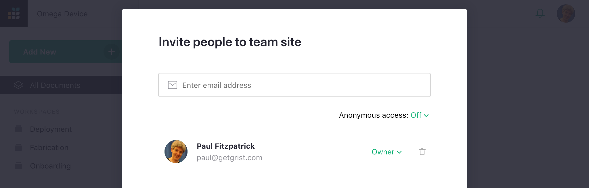
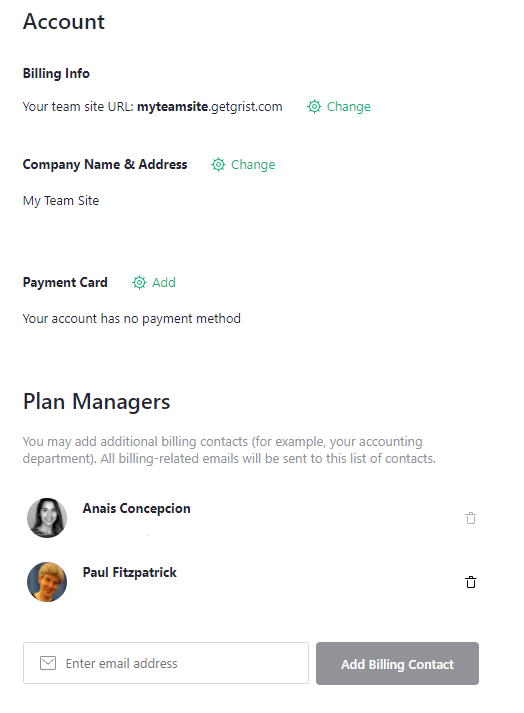
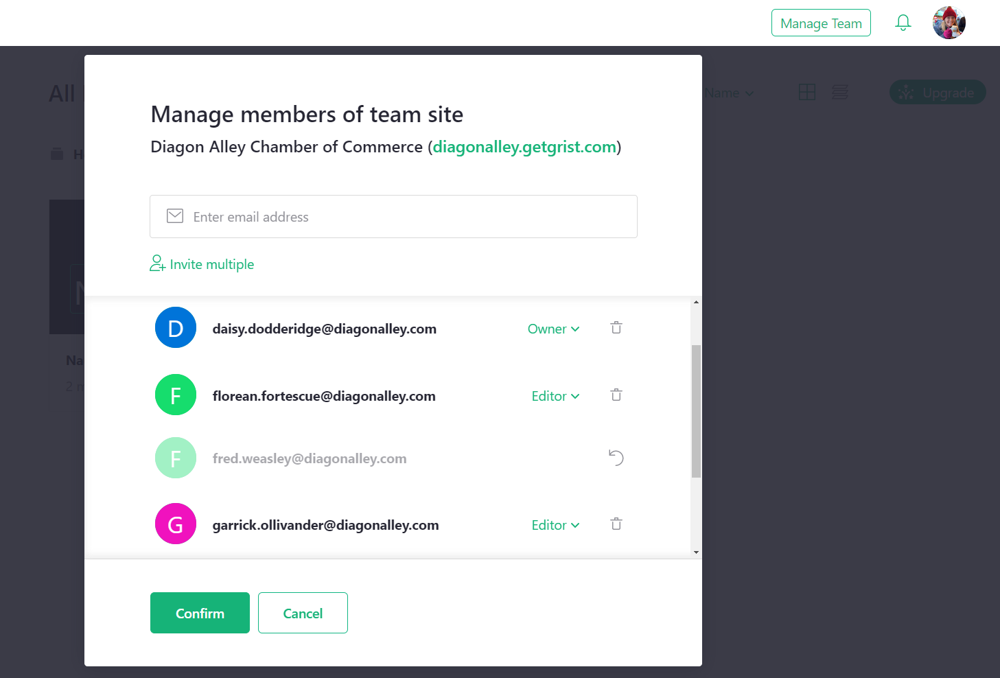

# Team Sharing

We saw how to share individual documents with other users in the
[Sharing](sharing.md) article.  Team sites give your further control,
allowing you to share a team site's collections of documents in whole or in part
with others. You may further group documents into [workspaces](workspaces.md) and edit permissions at the workspace-level as well.

To share a team site, click on the "Manage Team" button in the top right of your team site homepage.

You can now invite people just as you did for individual documents in
[Sharing](sharing.md).

**

Just as for documents, you can invite people as viewers, editors, or owners of the
team site.

All documents within the site will be accessible to those people,
unless you turn off the "Inherit access" sharing option for individual [workspaces](workspaces.md)
or [documents](sharing.md).

## Roles

There are three primary roles supported by Grist for team sites:

- **Viewer**: allows a user to view the site but not make any changes to it.
  A viewer will be allowed to view all workspaces and documents within the site
  unless otherwise specified.

- **Editor**: allows a user to view or make changes to the site and all its workspaces
  and documents (unless otherwise specified).  However, the sharing settings for the
  site, its workspaces, and its documents cannot be changed by an editor.

- **Owner**: gives a user complete permissions to the site's workspaces and documents,
  including their sharing settings.

## Billing Permissions

None of these roles give access to billing information or management.
Billing plan managers can be added via the "Billing Account" option. 
Open the user menu under your user icon, and select "Billing Account".

**
{: .screenshot-half }

## Removing Team Members

To remove a user from your team, click 'Manage Team' at the upper right of the page then click the delete icon to the right of their name. You must click the confirm button to save the change.

When users are removed from your team, your monthly bill will be reduced, prorated for the time remaining in the billing cycle.