# Page widget: Calendar

The calendar widget allows viewing data in a calendar view. In Grist, event data is stored in a data table. Then, the calendar widget can be configured to display that data.

*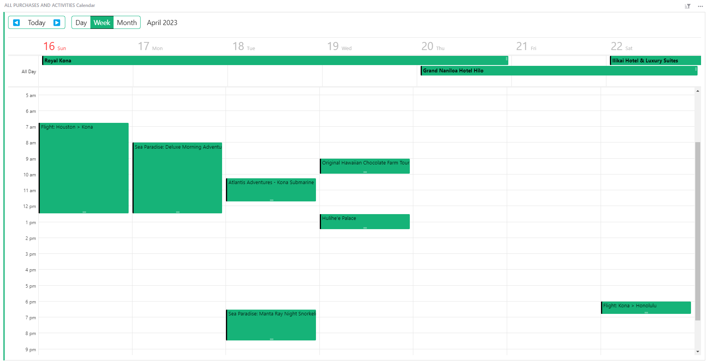*

## Setting up your data

In your data table, you will need three columns of data;

1. [Text](col-types.md#text-columns) column, containing the title of your event.
2. [Date](col-types.md#date-columns) or [DateTime](col-types.md#datetime-columns) column that will contain the date and time that the event begins.
3. [Date](col-types.md#date-columns) or [DateTime](col-types.md#datetime-columns) column, containing the date and time that the event ends.
4. [OPTIONAL] [Toggle](col-types.md#toggle-columns) column, noting if an event is all day long

*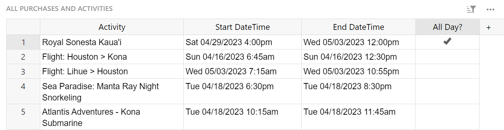*

## Configuring the calendar

Add a calendar widget from the ‘Add New’ menu. Select the table containing your event data.

*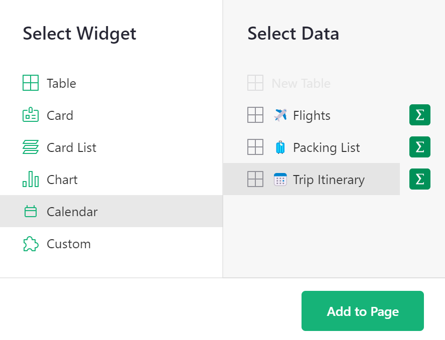*
{: .screenshot-half }

Configure the widget by selecting the columns in your data table that contain Start Date, End Date, Title and Is All Day (optional).

*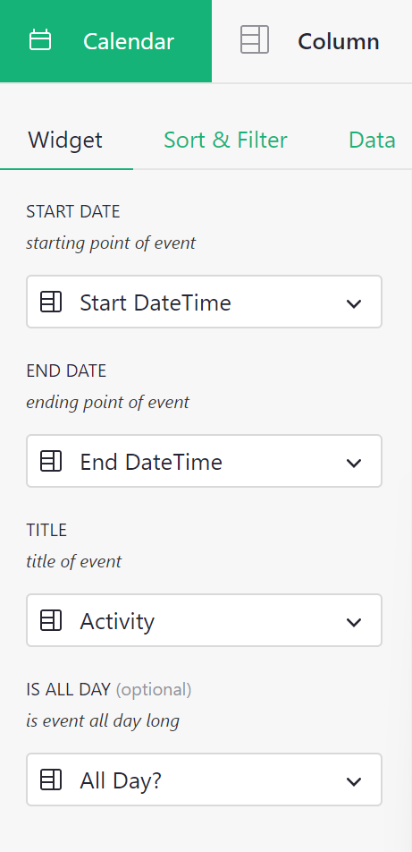*
{: .screenshot-half }

## Linking Event Details

Once you have your calendar widget added, it might be useful to see more event details in a table widget or a card widget.

This example will walk through a card widget.

To create a linked view, add a new type of widget such as a table or a card, and select the same data table. Under ‘Select By’, select the calendar widget. Then, add to page.

*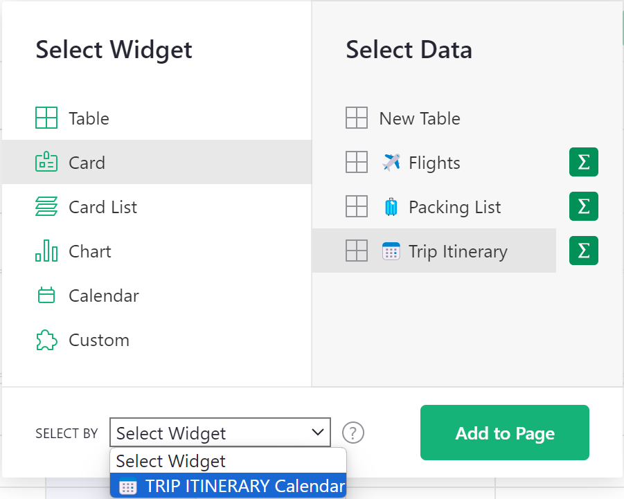*
{: .screenshot-half }

Now, when you click on an event in the calendar widget, the linked widget will update to show the details for the selected event.

*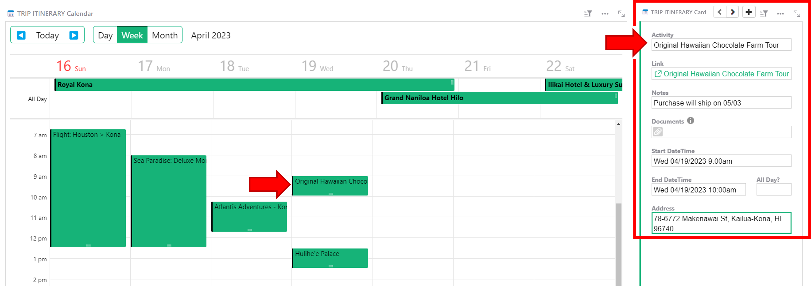*

## Adding a new event

You can add a new event by clicking on the start time for the event in the calendar widget. Select the New Event record in the calendar view to add event details in the linked widget.

*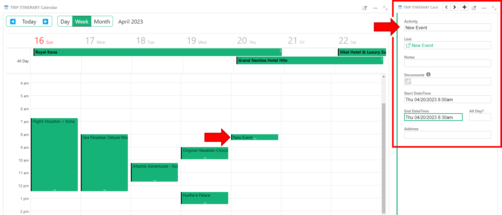*

!!! note "Collapsing widgets"
    Drag the linked widget into the attic at the top of the page to collapse. The widget will still be linked but will take up less space on the page! Simply click the box to expand and view linked record details.

    Read more on [Custom Layouts](custom-layouts.md)

You can modify the end time of an event by clicking and dragging from the bottom of the event. Updates to the end time will be reflected in the underlying data table.

*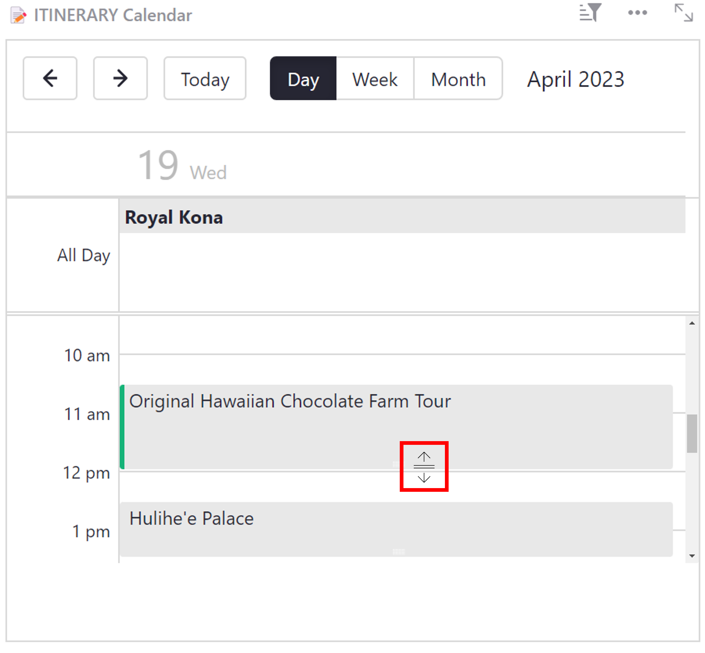*

You can also modify an event’s start time by clicking and dragging from the middle of the event. You’ll notice that the icon is slightly different from the icon that appears when modifying End Time. 

*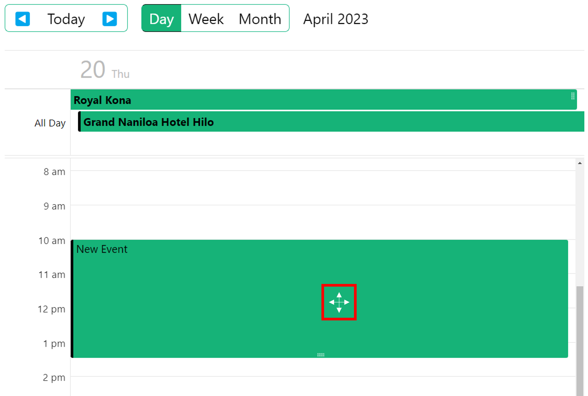*

When modifying start time, the duration of the event will remain the same. Any changes to Start and End time will be made to the underlying data table so your data will always be consistent!

## Deleting an event
To delete an event, select the event in the calendar so the linked widget updates to show the event’s details.

For a linked table widget, right click the record then select ‘Delete row’.

For a linked card widget, click the three-dot icon at the upper-right of the linked widget then ‘Delete record’.

*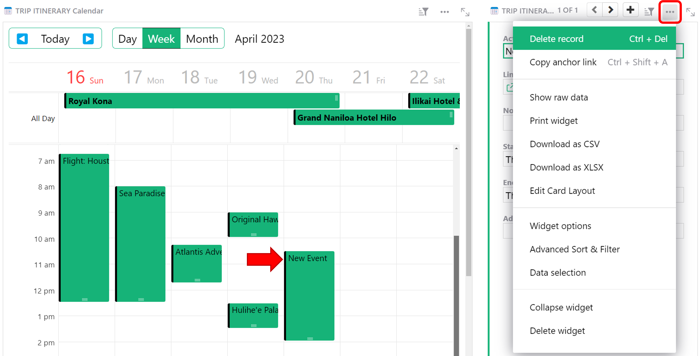*

If you do not have a linked widget, you can delete an event by clicking the three-dot icon at the upper-right of the calendar widget then ‘Show raw data’.

*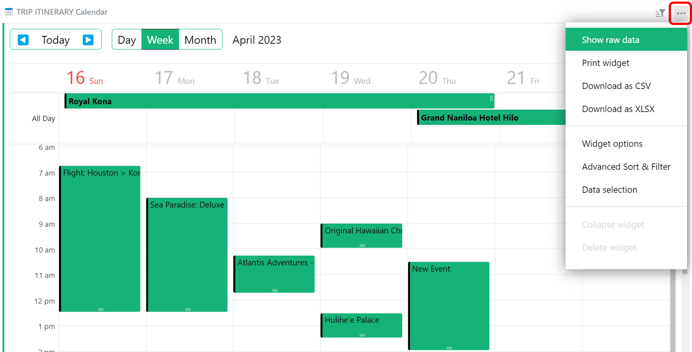*

Find the event you want to delete, then delete that record.

*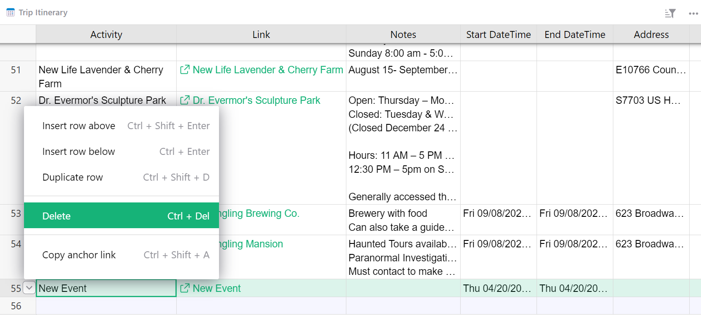*

!!! note "Keyboard shortcut"
    Use shortcut <code class="keys">*Ctrl* + *Delete*</code> on Windows or <code class="keys">*⌘* *Delete*</code> on Mac to delete the currently selected record(s)