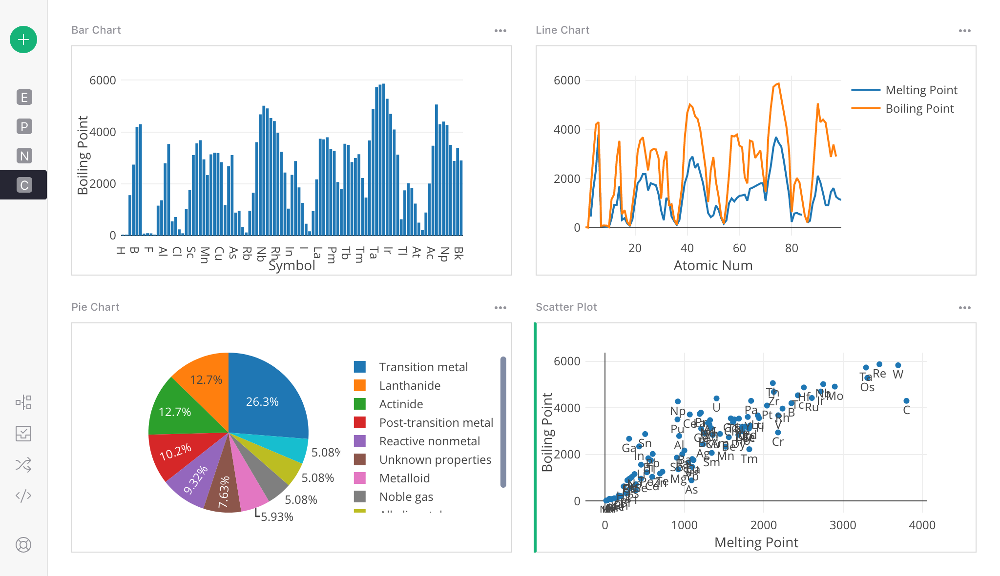
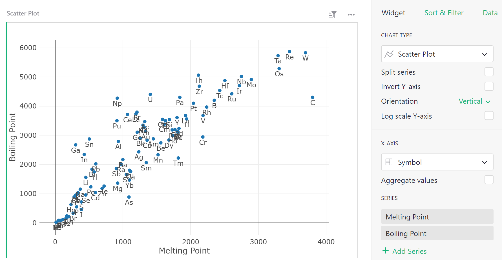
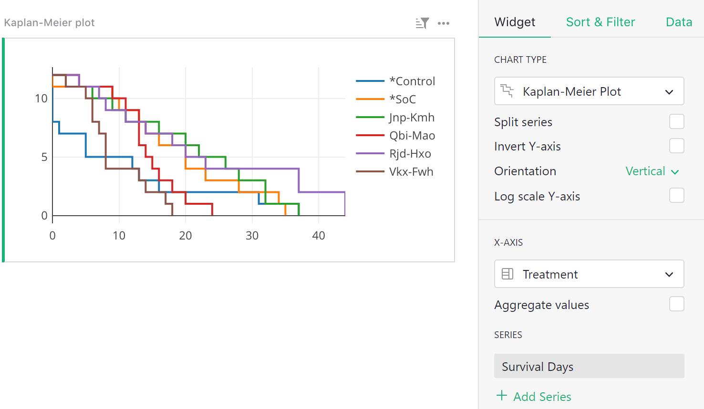
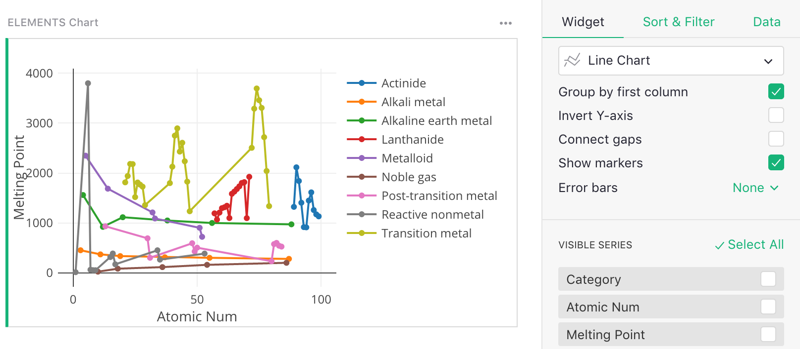

# Page widget: Chart

Grist supports several chart types to help you visualize your data easily. Charts may be used to plot a
regular table of data, a linked widget (as described in [Linking widgets](linking-widgets.md)), or
a summary table (as described in [Summary tables](summary-tables.md)).

The most common chart types are illustrated here:

## Chart types

Each chart type plots one or several data series. Select the series to plot by 
clicking the green 'Add Series' text in the [creator panel](glossary.md#creator-panel). In the area above the "Series" section of the creator panel, you may configure the x-axis for most charts, or the labels for pie and donut charts.

#### Bar Chart

Needs an x-axis and at least one series to plot along the y-axis. Additional series create 
additional bars at each point on the x-axis. To stack series onto the same bar, select the "Stack series" checkbox.

**

#### Line Chart

Needs an x-axis and at least one series to plot along the y-axis. 
Additional series specify Y values for additional lines.

**

#### Pie Chart

Needs pie slice labels and one series for the pie slice sizes.

**

#### Area Chart

Similar to a line chart, needs an x-axis and at least one series to plot along the y-axis. 
Additional series specify Y values for additional lines.

**

#### Scatter Plot

Needs a label and two or more series. The label applies to the points. The series apply the X and Y values for each point, respectively. Additional series specify Y values for additional sets of points.

**

#### Kaplan-Meier Plot

The [Kaplan-Meier Plot](https://en.wikipedia.org/wiki/Kaplan%E2%80%93Meier_estimator) is useful
for certain studies, and needs one label and one series. The label applies to the lines being plotted. The series gives a survival time or time-to-failure of that point. The plot shows the survival times on the X axis, and the number of points that survive at that time on the Y axis.

**

## Chart options

A number of chart options are available, some of them specific to certain chart types.

**Split Series**: When checked, an extra series is to be selected under the 'Split Series' dropdown. The series
should contain a group label for each data point. All points with the same group value are plotted as a separate line.

For example:

**

**Invert Y-axis**: When checked the Y axis is flipped, with smaller values above and larger values
below.

**Connect gaps** [for Line Charts only]: When checked, gaps caused by missing values are connected
by connecting neighboring points. The "Show Markers" option described next can be used to
keep a visual cue for which points are present.

**Show markers** [for Line Charts only]: When checked, each point on the line is marked
additionally by a small circle. See the example for Split Series above.

**Stack series** [for Line and Bar Charts]: When checked, split series will be stacked, rather than shown separately, giving a total for your selected series. In this example, we can see the total revenue for each month across all three departments. Note that 'Split series' must be checked in order to select multiple series to stack.

**

**Error bars** [for Line and Bar Charts]: When set to "Symmetric", each Y series should be
followed by a series for the length of the error bars to show. When set to "Above+Below", each Y
series should be followed by *two* series, one for the top error bars, and one for the bottom.

**

In the example here, "Split Series" is checked. So the series selected from the Split Series dropdown ("Cell Line"), specifies how to group the data into lines. 
The series selected under the X-Axis dropdown ("Log[Drug], uM"), specifies our values along the x-axis. Our first series in the Series list ("% Viable Cells"), specifies our y-axis values, and the series that follows that ("SD"), specifies the error bars for those Y values.
