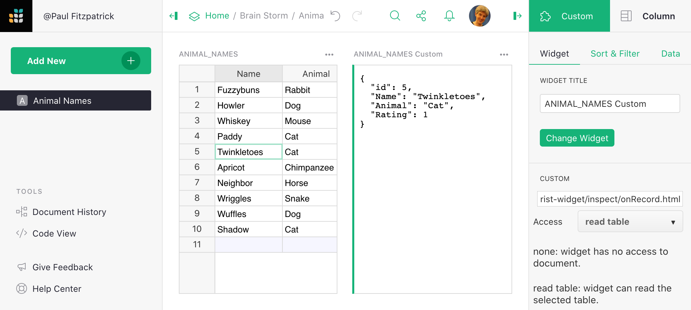

# Page widget: Custom

!!! warning "Custom widgets are an experimental feature"
    The design of custom widgets is likely to evolve, and sometimes
    that will require updates to documents that use them.  We won't
    make such changes lightly.

The **Custom** widget allows a user to insert almost
anything in their document.  To create a custom widget currently
requires knowledge of web development, and access to a public web
server (for example, GitHub Pages).

A good use for custom widgets is to view records or tables in new ways.
Using Grist as your data model and modern HTML/CSS/JS as your view is
very powerful.

## Minimal example

To demonstrate to a web developer how custom widgets work,
there is a minimal working example at:

> <https://public.getgrist.com/911KcgKA95oQ/Minimal-Custom-Widget/m/fork>

The example shows a table with some random data (names for pets), and
two custom widgets, one showing the selected row in the table as JSON,
and the other showing all rows of the table as JSON.  If you change
data in the table, or move the cursor, the custom widgets update as
appropriate.


The source code for the widgets is at:

> <https://github.com/gristlabs/grist-widget/tree/master/inspect>

It is stripped down to the essentials.  Here is the full source code of the
`onRecord` widget that shows one row of data:


```html
<!DOCTYPE html>
<html lang="en">
  <head>
    <meta charset="utf-8">
    <title>onRecord</title>
    <script src="https://docs.getgrist.com/grist-plugin-api.js"></script>
  </head>
  <body>
    <pre id="readout">Waiting for data...</pre>
    <script>
      grist.ready();
      grist.onRecord(function(record) {
        document.getElementById('readout').innerHTML = JSON.stringify(record, null, 2);
      });
    </script>
  </body>
</html>
```

The "Grist" parts of this are:

 * Including `https://docs.getgrist.com/grist-plugin-api.js` to get the Grist API.
 * Calling `grist.ready` to let Grist know the widget is ready to go.
 * Calling `grist.onRecord` to subscribe to the current row of the table.

After that, everything else is regular HTML/CSS/JS.
Once you have data coming in, you can render it any way you like, using React,
Vue.js, or your favorite framework.  For example, you could render
records as a [printable invoice](examples/2020-08-invoices.md), or use some
obscure chart format that Grist doesn't currently support.

## Adding a custom widget

To add a custom widget that reads from a table, click on `Add New`, 
then `Add Widget to Page`. Then:

  * For `Select Widget` choose `Custom` to get a Custom Widget.
  * For `Select Data` choose the table you want the widget to read data from.
  * Optionally, choose `Select By` to control the selected data further (read [Linking Page Widgets](linking-widgets.md) for the possibilities).


The custom widget is initially blank.  To configure it, click the three-dots button
on the top right of the custom widget, and select "Widget options".



In the `CUSTOM` settings section where it says `Full URL of webpage to show`, put
the link to your custom widget.  Here is a test widget to simply show table data
in JSON:

> <https://gristlabs.github.io/grist-widget/inspect/onRecords.html>

And here's one to show the selected row only (make sure "Select By" is set
for the custom widget):

> <https://gristlabs.github.io/grist-widget/inspect/onRecords.html>

The widget will then show the webpage you've requested.  Now you have the option
to grant that webpage access to data in your document.  The following access levels
are available:

   - *None*: the webpage is shown in the widget, but it has no access to
     the Grist document containing the widget.
   - *Read table*: the webpage is shown in the widget, and is given read access
     to the table the widget is configured to select data from.
   - *Full*: the webpage is shown in the widget, and has full access to
     read and modify the Grist document containing the widget.

The webpage should be owned and controlled by you or someone you
trust.  With `Read table` permissions, a widget could send the
data it accesses to a third party.  With `Full` permissions, a widget could
send all the document data to a third party, and modify your document in
any way.

We do not recommend using `Full` permissions at this time, since the API
for modifying the document is not yet stabilized.  If you have
an urgent need, however, do contact us and request early access.

## Invoice example

The minimal example above showed records as plain JSON, but the widget
can get as fancy as you like.  Here is an example of showing a record
as a printable invoice:


You can read the details of how to use
this widget in our [Invoice preparation example](examples/2020-08-invoices.md).
The invoice widget is hosted at:

> <https://gristlabs.github.io/grist-widget/invoices/>

And the source HTML/CSS/JS can be browsed at:

> <https://github.com/gristlabs/grist-widget/tree/master/invoices>

It uses Vue.js and `grist.onRecord`.
