# Page widget: Custom

!!! warning "Custom widgets are an experimental feature"
    The design of custom widgets is likely to evolve, and sometimes
    that will require updates to documents that use them.  We won't
    make such changes lightly.

The **Custom** widget allows a user to insert almost
anything in their document.  To create a custom widget currently
requires knowledge of web development, and access to a public web
server (for example, GitHub Pages).

A good use for custom widgets is to view records or tables in new ways.
Using Grist as your data model and modern HTML/CSS/JS as your view is
very powerful.

## Minimal example

To demonstrate to a web developer how custom widgets work,
there is a minimal working example at:

> <https://public.getgrist.com/911KcgKA95oQ/Minimal-Custom-Widget/m/fork>

The example shows a table with some random data (names for pets), and
two custom widgets, one showing the selected row in the table as JSON,
and the other showing all rows of the table as JSON.  If you change
data in the table, or move the cursor, the custom widgets update as
appropriate.

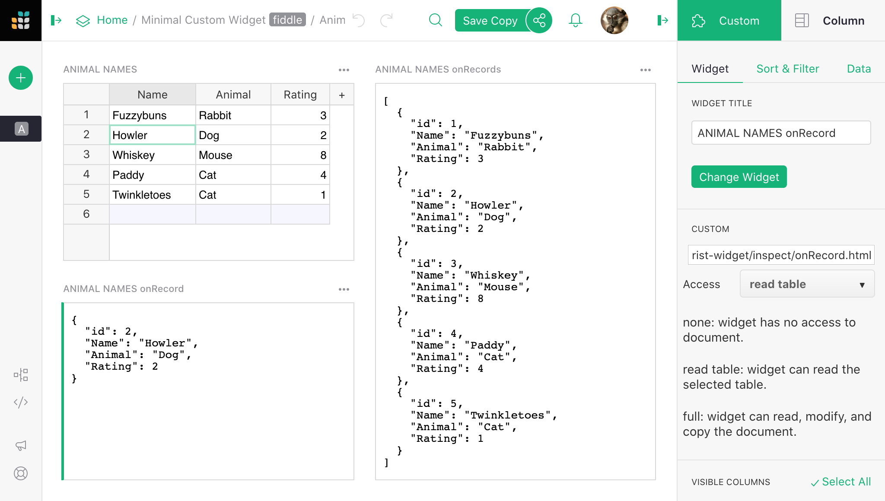

The source code for the widgets is at:

> <https://github.com/gristlabs/grist-widget/tree/master/inspect>

It is stripped down to the essentials.  Here is the full source code of the
`onRecord` widget that shows one row of data:


```html
<!DOCTYPE html>
<html lang="en">
  <head>
    <meta charset="utf-8">
    <title>onRecord</title>
    <script src="https://docs.getgrist.com/grist-plugin-api.js"></script>
  </head>
  <body>
    <pre id="readout">Waiting for data...</pre>
    <script>
      grist.ready();
      grist.onRecord(function(record) {
        document.getElementById('readout').innerHTML = JSON.stringify(record, null, 2);
      });
    </script>
  </body>
</html>
```

The "Grist" parts of this are:

 * Including `https://docs.getgrist.com/grist-plugin-api.js` to get the Grist API.
 * Calling `grist.ready` to let Grist know the widget is ready to go.
 * Calling `grist.onRecord` to subscribe to the current row of the table.

After that, everything else is regular HTML/CSS/JS.
Once you have data coming in, you can render it any way you like, using React,
Vue.js, or your favorite framework.  For example, you could render
records as a [printable invoice](examples/2020-08-invoices.md), or use some
obscure chart format that Grist doesn't currently support.

## Adding a custom widget

To add a custom widget that reads from a table, click on `Add New`, 
then `Add Widget to Page`. Then:

  * For `Select Widget` choose `Custom` to get a Custom Widget.
  * For `Select Data` choose the table you want the widget to read data from.
  * Optionally, choose `Select By` to control the selected data further (read [Linking Page Widgets](linking-widgets.md) for the possibilities).

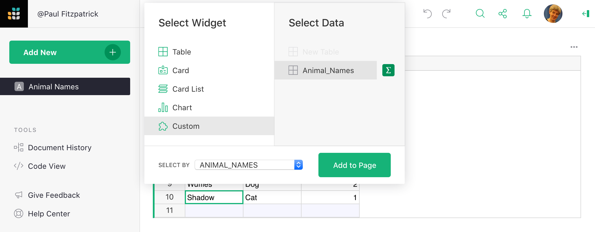

The custom widget is initially blank.  To configure it, click the three-dots button
on the top right of the custom widget, and select "Widget options".


In the `CUSTOM` settings section where it says `Enter Custom URL`, put
the link to your custom widget.  Here is a test widget to simply show table data
in JSON:

> <https://gristlabs.github.io/grist-widget/inspect/onRecords.html>

And here's one to show the selected row only (make sure "Select By" is set
for the custom widget):

> <https://gristlabs.github.io/grist-widget/inspect/onRecord.html>

## Access level

When you put a link to a custom webpage it will be immediately rendered inside the section. 
Now you have the option to grant that webpage access to data in your document.  The 
following access levels are available:

   - *No document access*: the webpage is shown in the widget, but it has no access to
     the Grist document containing the widget.
   - *Read selected table*: the webpage is shown in the widget, and is given read access
     to the table the widget is configured to select data from.
   - *Full document access*: the webpage is shown in the widget, and has full access to
     read and modify the Grist document containing the widget.

The webpage should be owned and controlled by you or someone you
trust.  With `Read selected table` permissions, a widget could send the
data it accesses to a third party.  With `Full document access` permissions, a widget could
send all the document data to a third party, and modify your document in
any way.

We do not recommend using `Full document access` permissions at this time, since the API
for modifying the document is not yet stabilized.  If you have
an urgent need, however, do contact us and request early access.

If you are writing your own custom widget you can specify what access level it needs as
part of the initial **ready** message. Possible values are: `none`, `read table` and
`full`.

```html
<script>
  grist.ready({
    requiredAccess: 'read table'
  });
</script>
```

This directs Grist to request the desired access level from the user. Your widget will be
reloaded with the appropriate access level if the user approves the request.

<span class="screenshot-large">*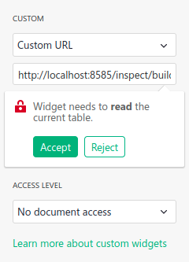*</span>
{: .screenshot-half }

If you wish to get notified of the access level, you can subscribe to the `onOptions`
event that is sent to the widget after it tells Grist it is ready:

```javascript
grist.onOptions(function(options, interaction) {
  console.log(interaction.access_level);
});
```

For now, just skip the `options` parameter (it will be described in
[Widget options](widget-custom.md#widget-options) section). The current access level is part of
the second parameter, which describes how Grist will interact with your widget.

## Invoice example

The minimal example above showed records as plain JSON, but the widget
can get as fancy as you like.  Here is an example of showing a record
as a printable invoice:

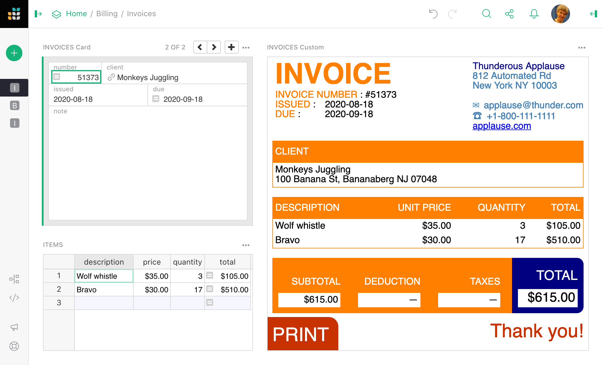

You can read the details of how to use
this widget in our [Invoice preparation example](examples/2020-08-invoices.md).
The invoice widget is hosted at:

> <https://gristlabs.github.io/grist-widget/invoices/>

And the source HTML/CSS/JS can be browsed at:

> <https://github.com/gristlabs/grist-widget/tree/master/invoices>

It uses Vue.js and `grist.onRecord`.

## Creating a custom widget

As you saw, writing a simple widget that uses data from a table is very easy. First, you
need to tell Grist that you are ready and then subscribe to one of the available events:
`onRecord`, `onRecords` or `onOptions`.

```javascript
grist.ready();
grist.onRecord(function (record) {
  // Cursor has moved.
});
grist.onRecords(function (record) {
  // Data in the table has changed.
});
grist.onOptions(function (options, interaction) {
  // Configuration has changed.
});
```

Let's say you want to build a custom widget that will show an image from a URL and
optionally a single line of text below as the image title. You will need to
read two values from two columns: `Link` and `Title`.

You could access those columns directly using literal column names in your
script. Here is a complete example of widget source code that will do the job:

```html
<script src="https://docs.getgrist.com/grist-plugin-api.js"></script>

<div id="title"></div>
<script>
  grist.ready({requiredAccess: 'read table'});
  grist.onRecord(function (record) {
    document.getElementById('image').src = record.Link;
    document.getElementById('title').innerText = record.Title;
  });
</script>
```

When getting started, this is a good approach, but it has two significant drawbacks. Every
time you rename a column, you will also have to change your widget's source. Moreover,
using this widget on a different table or sharing it with your friends can be difficult as
column names might be different. To help with this, Grist offers the column mapping API.

## Column mapping

Instead of using column names directly, you can ask the user to pick which column to use
as a `Link` and `Title`. The list of expected columns can be sent to Grist as part of the
ready call:

```js
grist.ready({columns: ['Link', 'Title']});
```

Using this information, in the creator panel, Grist will hide the regular "Visible"
columns section and display specialized column pickers.

<span class="screenshot-large">*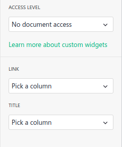*</span>
{: .screenshot-half }

Your widget will receive this mapping configuration as part of `onRecord` or `onRecords`
event in the second parameter. You can use this configuration to do the mappings yourself
or use the `mapColumnNames` helper function to do it for you.

```html
<script src="https://docs.getgrist.com/grist-plugin-api.js"></script>

<div id="title"></div>
<script>
grist.ready({columns: ['Link', 'Title'], requiredAccess: 'read table'});
grist.onRecord(function (record, mappings) {
  const mapped = grist.mapColumnNames(record);
  // First check if all columns were mapped.
  if (mapped) {
    document.getElementById('image').src = mapped.Link;
    document.getElementById('title').innerText = mapped.Title;
    console.log(`Using ${mappings.Link} and ${mappings.Title} columns`);
  } else {
    // Helper returned a null value. It means that not all
    // required columns were mapped.
    console.error("Please map all columns");
  }
});
</script>
```

Now, if you rename one of the columns, the widget will still work. You can also use this
widget in any other table or share with a friend, as it doesn't depend on your table
structure and can be easily configured.

In the configuration used above, we told Grist that all the columns are required, and the
user can pick any column even if the column doesn't contain a text value. To be more
precise, we can include more options in the request. For example:

```javascript
grist.ready({columns: [
  {
    name: "Link", // What field we will read.
    title: "Image link", // Friendly field name.
    optional: false, // Is this an optional field.
    type: "Text" // What type of column we expect.
  }
]});
```

The `optional` setting is important for correct operation of the `mapColumnNames` helper.
This helper will return a mapped record only when all required (not optional) columns are
picked.

By default Grist will allow the user to pick any type of column. To allow only a column of
a specific type, you need to set a `type` property. Here are all valid types:

`Any`, `Int` (*Integer column*), `Numeric` (*Numeric column*), `Text`, `Date`, `DateTime`,
`Bool` (*Toggle column*), `Choice`, `ChoiceList`, `Ref` (*Reference column*), `RefList`
(*Reference List*), `Attachments`.

Suppose the user deletes a column or changes its type so that it will no longer match the
type requested by the widget. In that case, Grist will automatically remove this column
from the mapping.

## Widget options

If your widget needs to store some options, Grist offers a simple key-value storage API
for you to use. Here are some JavaScript code snippets that show how to interact with
this API:

```js
// Store a simple text value .
await grist.setOption('color', '#FF0000');

// Store complex objects as JSON.
await grist.setOption('settings', {lines: 10, skipFirst: true});

// Read previously saved option
const color = await grist.getOption('color');

// Clear all options.
await grist.clearOptions();

// Get and replace all options.
await grist.getOptions();
await grist.setOptions({...});
```

You can experiment with this yourself. Here is a test widget that demonstrates how to use
this API:

> <https://gristlabs.github.io/grist-widget/inspect/onOptions.html>

When your widget saves or edits some options, the icon on top of the section gets
highlighted in green. You can either apply those options to the widget or revert that
modification.

<span class="screenshot-large">**</span>
{: .screenshot-half }

This allows viewers (users with read-only access) or collaborators to
configure your widget without overwriting original settings. This behavior should look
familiar to you and others, as this works like
[sorting and filtering](search-sort-filter.md#saving-sort-settings) on table or card
views.

Saving current options you will apply them to the widget and make them available to
others. Using this menu, you can also clear all options to revert the widget to its
initial state. To do this, press the little trash icon and then `Save`.

Grist will also trigger an event, every time the options are changed (or cleared). Here is
how you can subscribe to this event.

```javascript
grist.onOptions(function(options, interaction) {
  if (options) {
    console.log('Current color', options.color);
  } else {
    // No widget options were saved, fallback to default ones.
  }
});
```

If you are building your own widget, you generally should not read options directly (using
`grist.widgetApi.getOption()`). A better pattern is to apply them all when they are
changed. Using the `onOptions` handler will make your widget easier to change and
understand later.

There is one more scenario to cover. Suppose your widget has some kind of custom
configuration screen. In that case, you probably need some button or other UI element that
the user can use to show it. This additional UI element will likely be rarely used by you
or your collaborators, so it doesn't make sense to show it all the time. To help with
this, Grist offers an additional interaction option you can send as part of the ready
message:

```javascript
grist.ready({
  onEditOptions: function() {
    // Your custom logic to open the custom configuration screen.
  }
});
```

This will tell Grist to display an additional button `Open configuration` in the creator
panel and the section menu. When clicked, it will trigger your handler, which you can use
to show your own custom configuration screen.

<span class="screenshot-large">*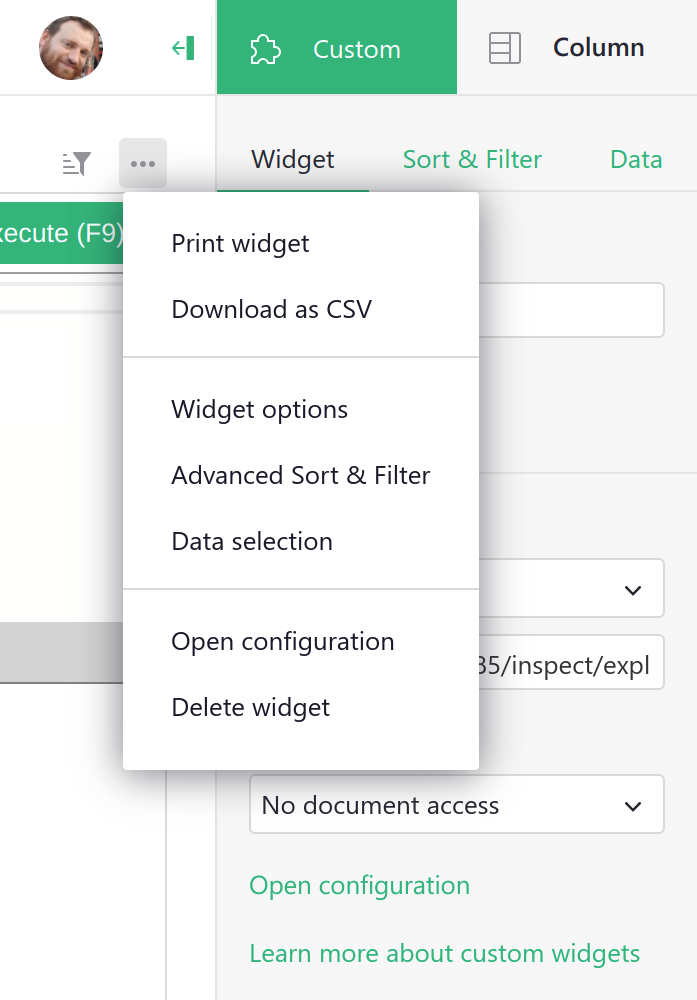*</span>
{: .screenshot-half }

## Premade Custom Widgets

All premade custom widgets are available in the Custom Widget configuration panel on the right-hand side of the screen under the Custom dropdown. 

<span class="screenshot-large">*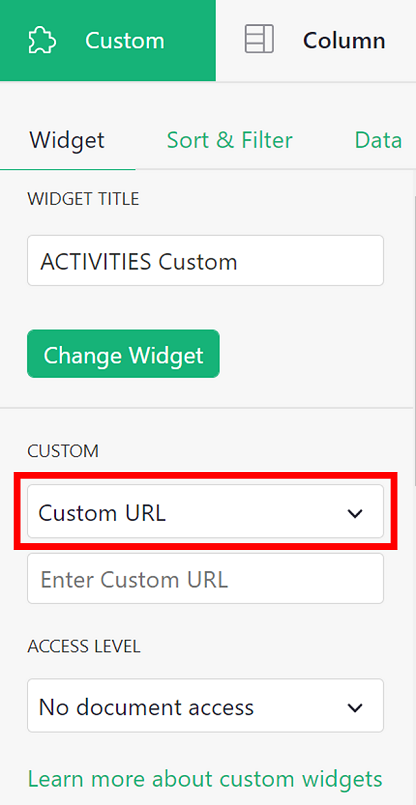*</span>
{: .screenshot-half }

### Action Button

An action button can be configured to do anything that you as a user can do. Two common uses are Duplicate and Delete.

The formula for Duplicate is:
```
{"button":"Duplicate", "description":"Duplicate record " + $COLUMN_NAME,"actions":[["AddRecord", "TABLE_NAME", None, {"COLUMN_A_NAME":$COLUMN_A_NAME, "COLUMN_B_NAME": $COLUMN_B_NAME}]]}
```
`COLUMN_NAME` is the name of the column from where you'd like to pull details into your Action Button (ex: Duplicate Record ______ ). 

`TABLE_NAME` is the name of the table you are duplicating data in.

`COLUMN_A_NAME` is the first column from which you'd like to duplicate data from.

`COLUMN_B_NAME` is the second column from which you'd like to duplicate data from.

Create a formula column in your table and enter the Duplicate formula, filling in the generic column and table names with your data.

<span class="screenshot-large">**</span>

Add a custom widget to the page. Choose the data table that contains the action button formula and 'Select By' that same table.

<span class="screenshot-large">**</span>
{: .screenshot-half }

Select the premade 'Action Button' custom widget from the dropdown and allow for full document access under Access Level. Under the Action dropdown, select the column that contains your formula. 

Now you have a button to duplicate records! Select a record in your table then click 'Duplicate'. That record will be duplicated in your table.

<span class="screenshot-large">**</span>
The formula for Delete is:
```
{"button":"Delete", "description":"Delete record " + $COLUMN_NAME,"actions":[["RemoveRecord", "TABLE_NAME", rec.id]]}
```
`COLUMN_NAME` is the name of the column from where you'd like to pull details into your Action Button (ex: Delete Record ______ ).

`TABLE_NAME` is the name of the table you are deleting data from.

Follow the steps from above to create an action button that will delete the selected record.

Note that these options are both built into Grist. You can 'Duplicate row' and 'Delete row' by right clicking on a cell and selecting the option from the menu.

<span class="screenshot-large">**</span>
{: .screenshot-half }

### Copy to clipboard

Copy to clipboard copies a value from the specified column of the selected record. When configuring the widget, you will need to select which column you wish to copy data from. 

<span class="screenshot-large">**</span>

Note that you can also copy data from a selected cell by using the keyboard shortcut <code class="keys">*Ctrl* + *C*</code> on Windows or <code class="keys">*⌘* + *C*</code> on Mac. To paste, use <code class="keys">*Ctrl* + *V*</code> or <code class="keys">*⌘* + *V*</code>.

### Dropbox Embedder

View and access files saved to dropbox. 

<span class="screenshot-large">*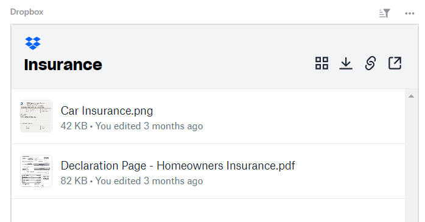*</span>
{: .screenshot-half }

To start, add a new column to your table to store your dropbox links. 

Then, add a new custom widget to the page. Choose the data table that contains the dropbox links and 'Select By' that same table.

<span class="screenshot-large">*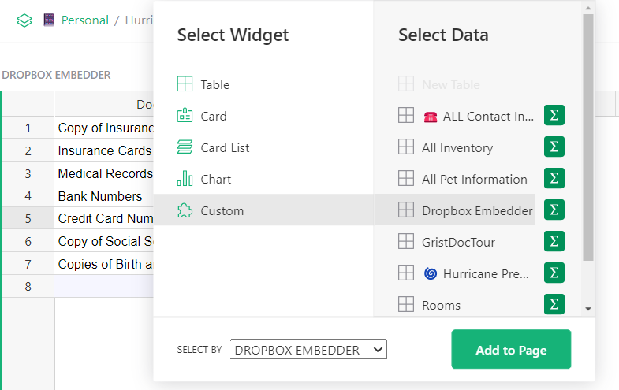*</span>
{: .screenshot-half }

To configure, select 'Dropbox Embedder' from the Custom dropdown and allow access to read the selected table. Under 'Dropbox Link', select the column that contains your dropbox links.

<span class="screenshot-large">**</span>
{: .screenshot-half }

You can create links to folders or specific files in Dropbox. Click 'Share' then set permissions for the link. You can choose to allow anyone with the link to view or edit. Create, then copy the link. Paste this link into your Dropbox Link column in Grist.

<span class="screenshot-large">*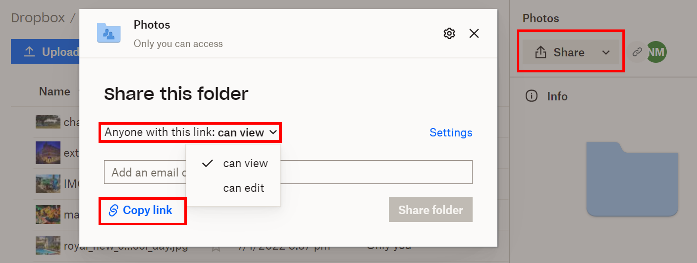*</span>

You can check out an example of the Dropbox Embedder in our [Hurricane Preparedness](https://templates.getgrist.com/uXMbETLdfriM/Hurricane-Preparedness){:target="\_blank"} template.

<span class="screenshot-large">*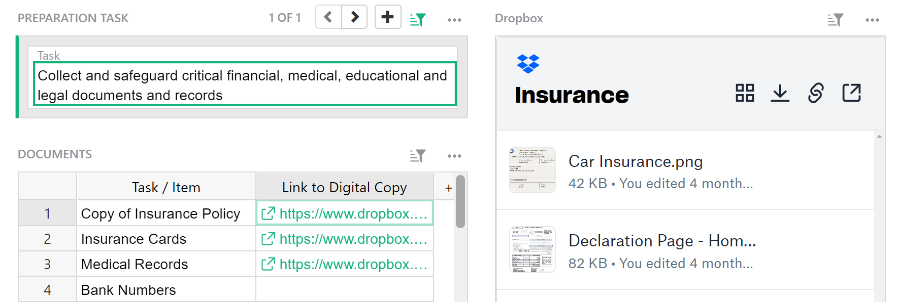*</span>

### Grist Video Player

Embed videos from online sources like YouTube, Vimeo, Facebook Video, Google Drive and more.

<span class="screenshot-large">**</span>

To start, add a new column to your table to store your video URLs. 

Then, add a new custom widget to the page. Choose the data table that contains the video URLs and 'Select By' that same table.

<span class="screenshot-large">*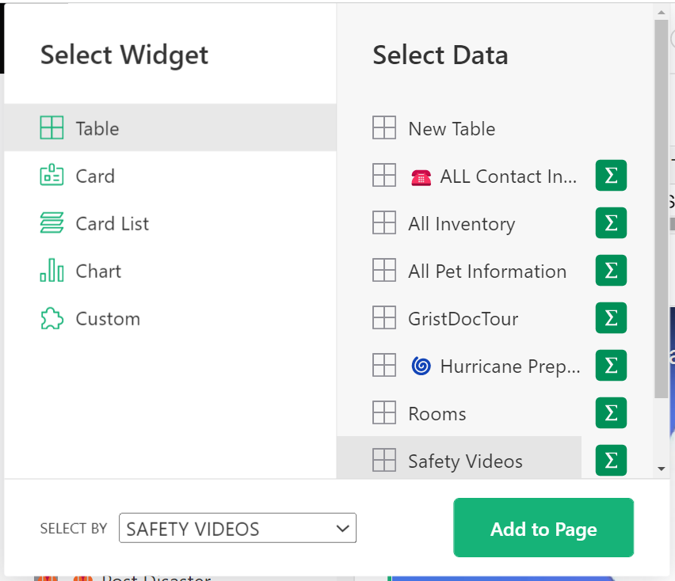*</span>
{: .screenshot-half }

To configure, select 'Grist Video Player' from the Custom dropdown and allow access to read the selected table. Under 'URL', select the column that contains your video URLs.

<span class="screenshot-large">*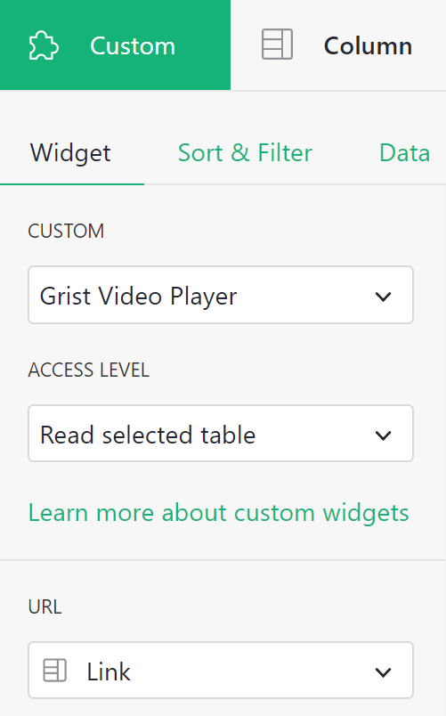*</span>
{: .screenshot-half }

For most online videos, including YouTube videos and videos stored on Google Drive, you can simply click the 'Share' option and copy the URL. 

<span class="screenshot-large">**</span>
{: .screenshot-half }

For some other videos, you may see this error:

<span class="screenshot-large">**</span>
{: .screenshot-half }

If this happens, you'll need to take the URL from the Embed code.

After clicking the share option on the video, click the option to 'Embed'.

<span class="screenshot-large">*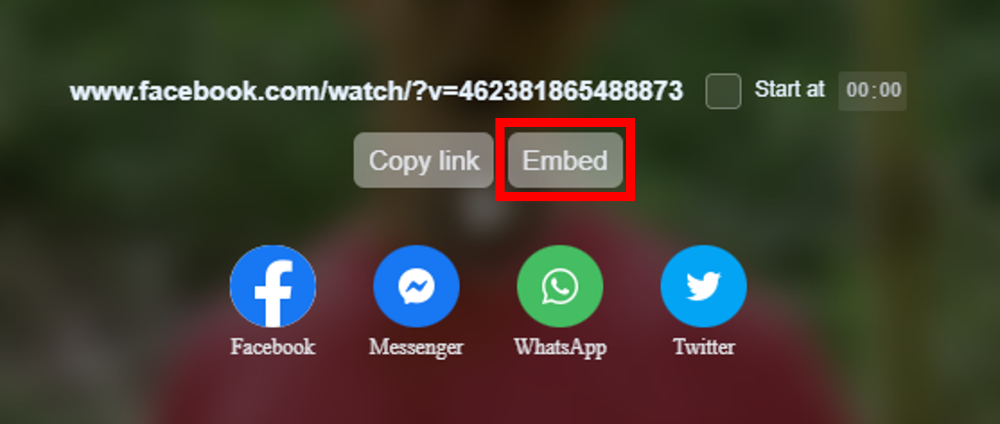*</span>
{: .screenshot-half }

Then, click to copy the code.

<span class="screenshot-large">**</span>
{: .screenshot-half }

The code it gives you will look something like this:

<span class="screenshot-large">**</span>
{: .screenshot-half }

Copy the URL that is found between quotes following `src`. The highlighted portion in the screenshot below is what you would copy for this particular Facebook video. 

<span class="screenshot-large">**</span>
{: .screenshot-half }

Paste this URL into your URL column in Grist and the video will now appear in the Grist Video Player custom widget.

<span class="screenshot-large">*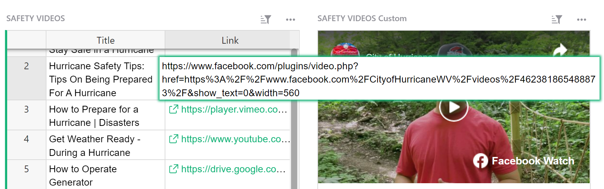*</span>

### HTML Viewer

The HTML Viewer allows you to format text using HTML while displaying the formatted text in a read-only widget.

For other text-editing widgets, check out our [Markdown](#markdown) and [Notepad](#notepad) custom widgets.

<span class="screenshot-large">*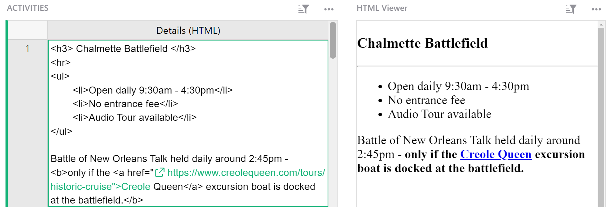*</span>

To start, add a new column to your table. This will be where you add your text with HTML formatting. 

Then, add a new custom widget to the page. Choose the data table that contains the HTML formatting and 'Select By' that same table.

<span class="screenshot-large">*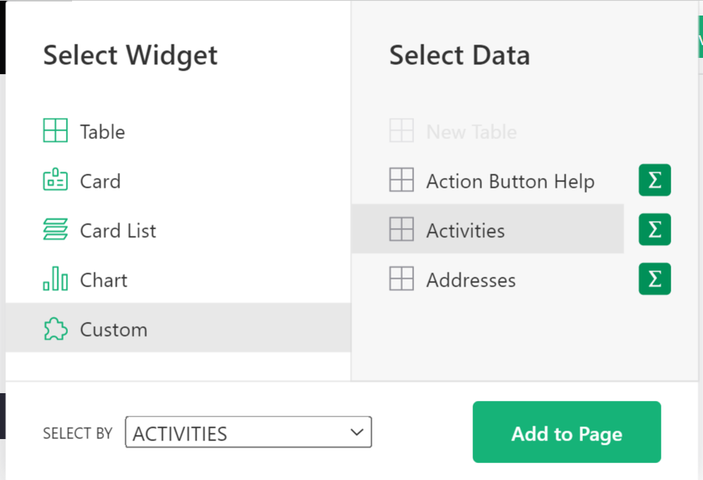*</span>
{: .screenshot-half }

To configure, select 'HTML Viewer' from the Custom dropdown and allow access to read the selected table. Under 'HTML', select the text column that HTML formatting.

<span class="screenshot-large">*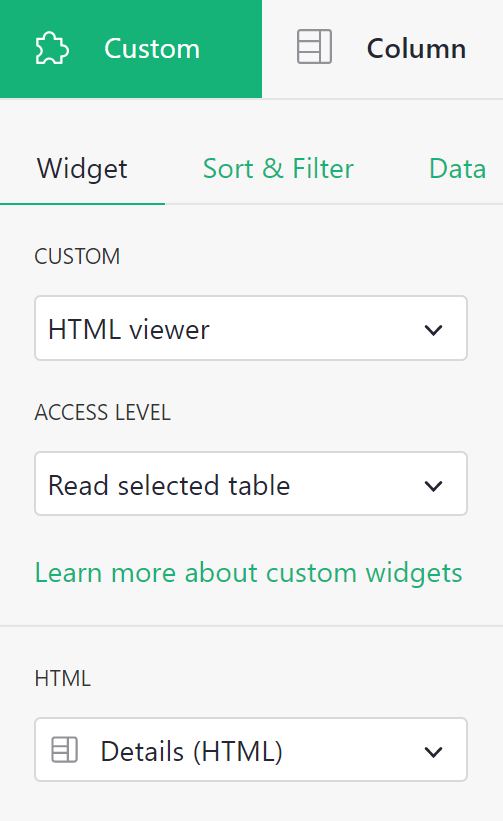*</span>
{: .screenshot-half }

Any HTML formatting in the specified text column will apply and be viewable in the custom widget.

<span class="screenshot-large">*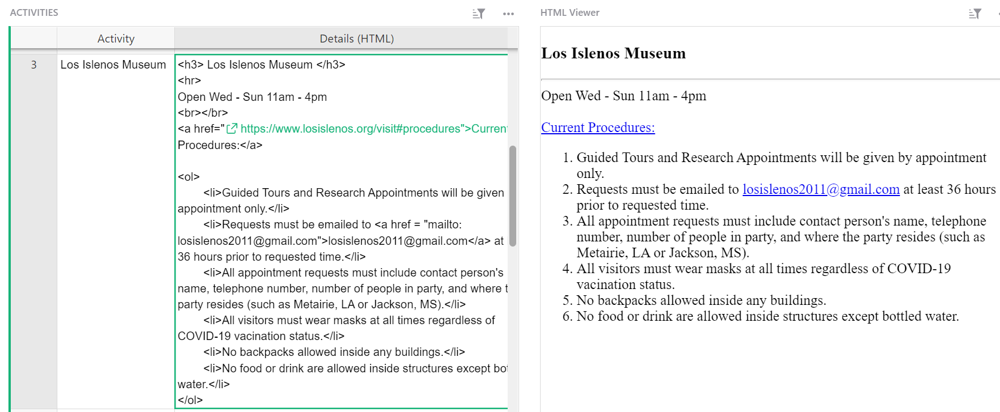*</span>

For help on HTML formatting, check out this guide from W3 Schools: [HTML Text Formatting](https://www.w3schools.com/html/html_formatting.asp){:target="\_blank"}

### Image Viewer

Embed images from online sources.

<span class="screenshot-large">*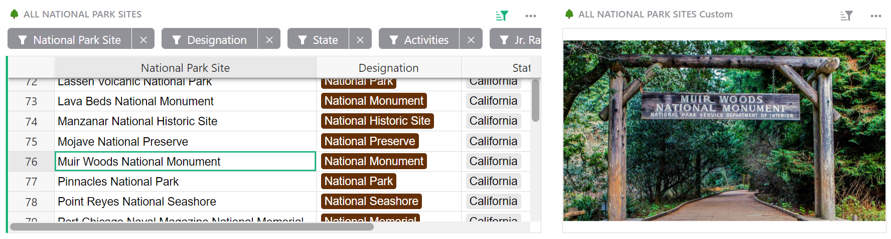*</span>

To start, add a new column to your table. This will be where you add the URL for your image. 

Then, add a new custom widget to the page. Choose the data table that contains the image URL and 'Select By' that same table.

<span class="screenshot-large">*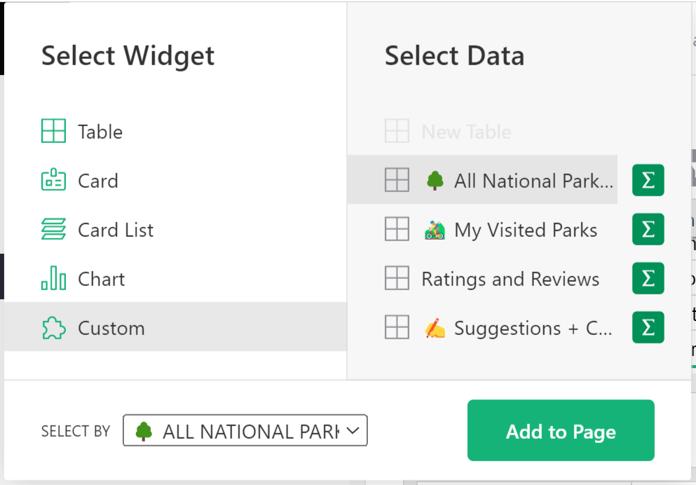*</span>
{: .screenshot-half }

To configure, select 'Image Viewer' from the Custom dropdown and allow access to read the selected table. Under 'Image URL', select the column that contains the URLs for your images.

<span class="screenshot-large">*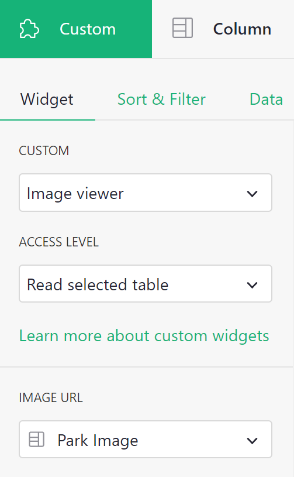*</span>
{: .screenshot-half }

To copy the URL for an image, right click on the photo then 'Copy image address'. This copies the URL to your clipboard. Paste this URL into your specified column in Grist.

<span class="screenshot-large">*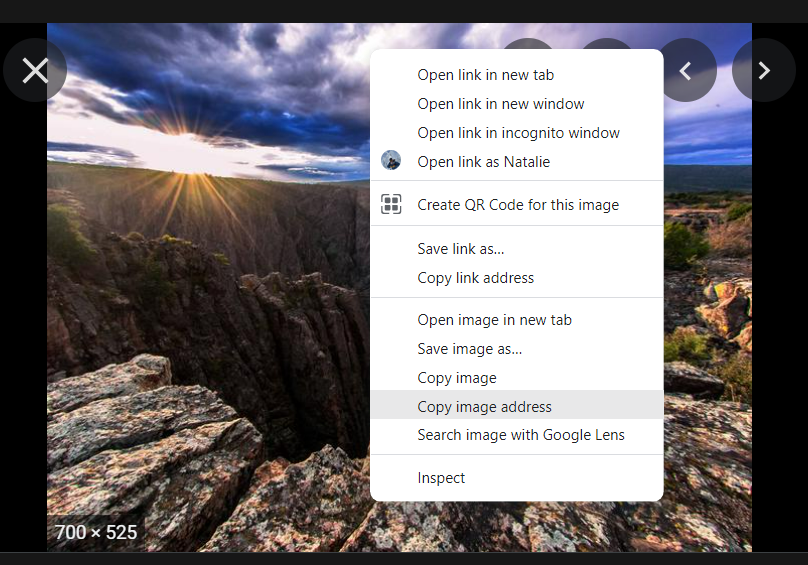*</span>
{: .screenshot-half }

For an example of the Image Viewer widget, check out our [U.S. National Park Database](https://templates.getgrist.com/4TRbjZXSPtR5/US-National-Park-Database/p/4){:target="\_blank"}, and add a park review while you're there!

### Map

The custom map widget allows you to display locations using lat-long coordinates. If your data is an address, rather than in lat-long format, Grist can convert the address into lat-long coordinates. 

<span class="screenshot-large">*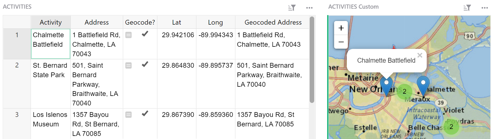*</span>

If using existing lat-long coordinates, you will need three columns; Name, Longitude and Latitude.

<span class="screenshot-large">*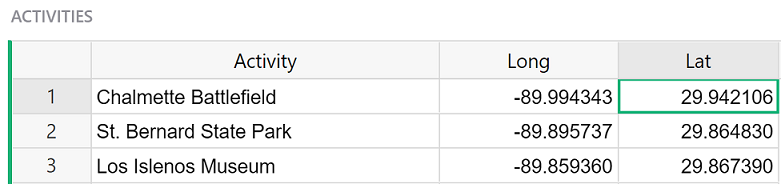*</span>
{: .screenshot-half }

If using an address, you will need six columns; Name, Address, Geocode, Longitude, Latitude, and Geocoded Address.

<span class="screenshot-large">*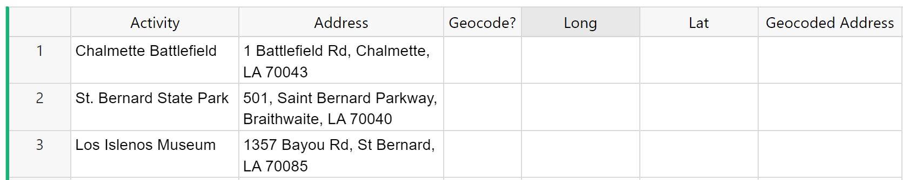*</span>

Geocode is a [toggle type column](col-types.md#toggle-columns) that should be set to true for any record you wish to convert from address to lat-long coordinates to be shown on the map.

If you wish to convert all records, you can make Geocode a formula column with the formula = `True`. This will mark all records as True.

<span class="screenshot-large">*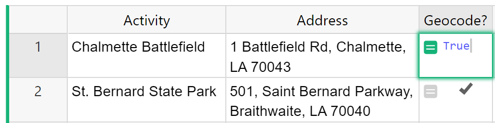*</span>
{: .screenshot-half }

Next, add a new custom widget to the page. Choose the data table that contains the addresses or lat-long coordinates and 'Select By' that same table.

<span class="screenshot-large">*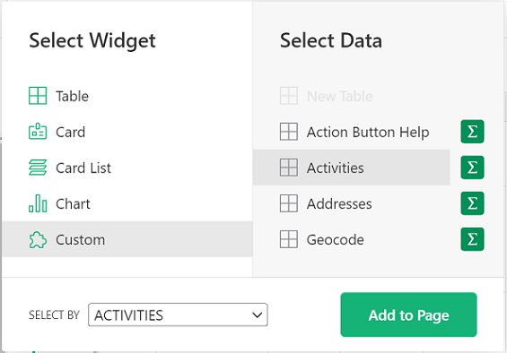*</span>
{: .screenshot-half }

To configure, select 'Map' from the Custom dropdown. 

If you already have **lat-long coordinates**, you can set your access level to *Read selected table*. 

If you are using an **address** and wishing for Grist to convert the address to lat-long coordinates, you will need to set your access level to *Full document access* because the widget needs permission to write to your document in order to add lat-long coordinates.

<span class="screenshot-large">*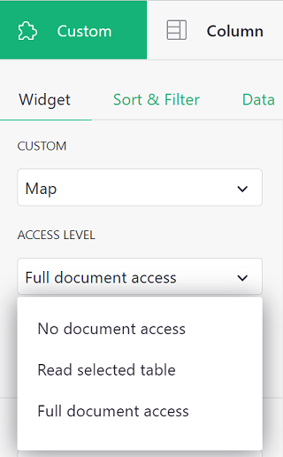*</span>
{: .screenshot-half }

Map all required columns. Note that Name, Longitude and Latitude are labeled as required. Geocode, Address and Geocoded Address are listed as optional. If you are using addresses and need Grist to convert these to lat-long coordinates, you must map all six columns.

<span class="screenshot-large">*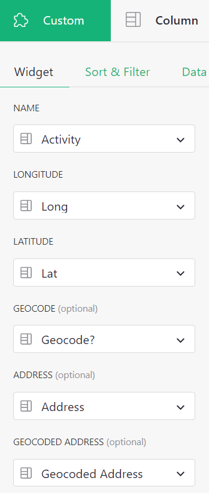*</span>
{: .screenshot-half }

After mapping the necessary columns and selecting the appropriate Access Level, the map widget will populate. 

<span class="screenshot-large">*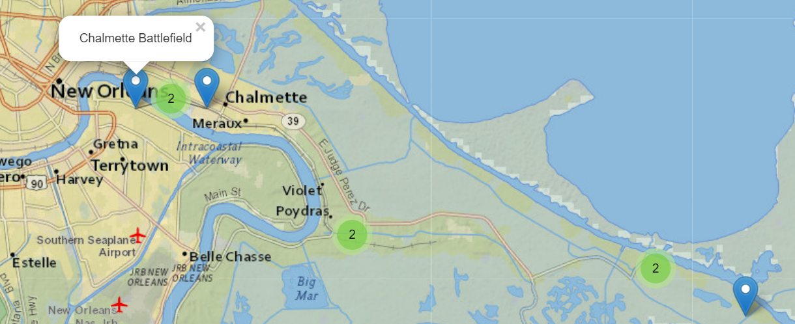*</span>

You can configure the map to show only the selected location by clicking the 'Open Configuration' option in the Custom Widget Configuration panel on the right-hand side. Then, uncheck 'All Locations'. Click the green check mark at the top of the widget to save the updated configuration settings.

<span class="screenshot-large">**</span>

### Markdown

The Markdown custom widget allows you to format text using Markdown while displaying the formatted text in an editable widget.

For other text-editing widgets, check out our [HTML](#html-viewer) and [Notepad](#notepad) custom widgets.

<span class="screenshot-large">*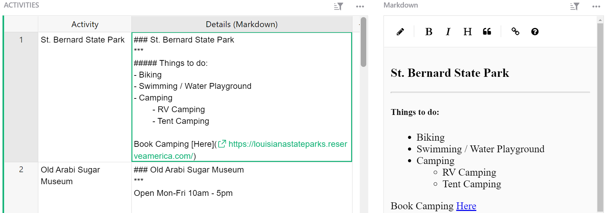*</span>

To start, add a new column to your table. This will be where you will add your text that will be formatted using Markdown. 

Then, add a new custom widget to the page. Choose the data table that contains the text formatted with Markdown and 'Select By' that same table.

<span class="screenshot-large">*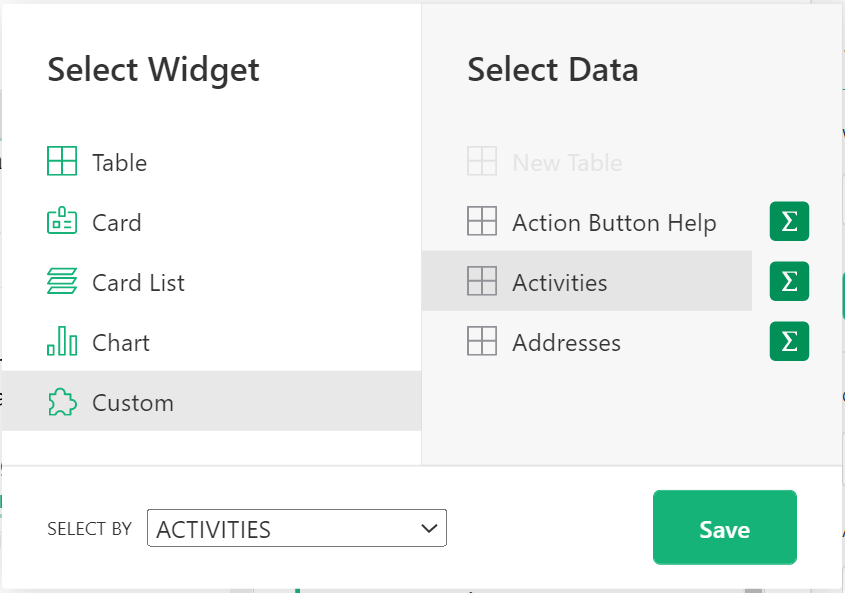*</span>
{: .screenshot-half }

To configure, select 'Markdown' from the Custom dropdown and allow **Full document access**. Because the widget is also an editor, it needs permission to write to the document.

Under 'Content', select the text column that contains Markdown formatting.

<span class="screenshot-large">*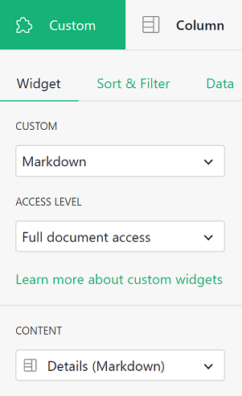*</span>
{: .screenshot-half }

Any Markdown formatting in the specified text column will apply and be viewable and editable in the custom widget.

<span class="screenshot-large">*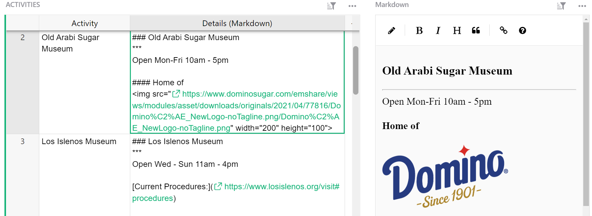*</span>

To edit the text directly in the widget, click the edit icon. The text will revert to display Markdown syntax that can be edited directly in the widget. When in edit mode, the edit icon will be replaced with the save icon. Be sure to click the save icon to save any changes and return to viewing the formatted text.

<span class="screenshot-large">*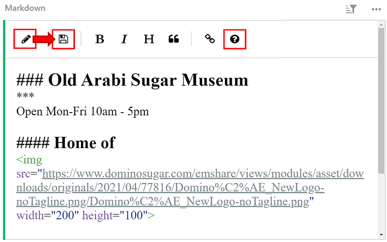*</span>
{: .screenshot-half }

For help on Markdown formatting, check out the [Markdown Guide](https://www.markdownguide.org/basic-syntax/){:target="\_blank"} for basic syntax. This guide is also accessible in the Markdown widget by clicking the information icon at the top of the widget. The guide will open in a new tab of your browser for easy reference.

### Notepad

The Notepad custom widget allows you to format text using a WYSIWYG editor.

For other text-editing widgets, check out our [HTML](#html-viewer) and [Markdown](#markdown) custom widgets.

<span class="screenshot-large">*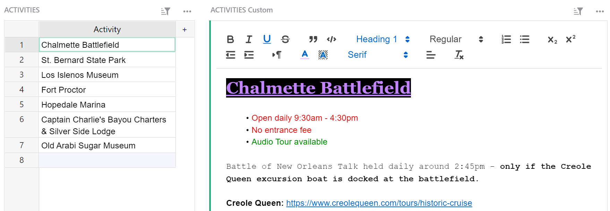*</span>

To start, add a new column to your table. This will be where details for our formatted text will be stored. 

Then, add a new custom widget to the page. Choose the data table that contains the column we just added and 'Select By' that same table.

<span class="screenshot-large">*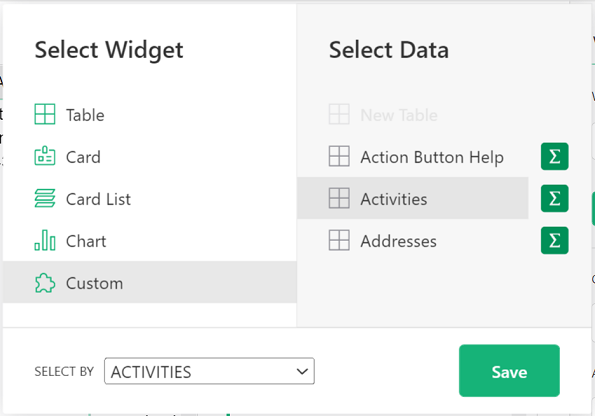*</span>
{: .screenshot-half }

To configure, select 'Notepad' from the Custom dropdown and allow **Full document access**. Because the widget is also an editor, it needs permission to write to the document.

Under 'Content', select the column created to store our formatted text.

<span class="screenshot-large">*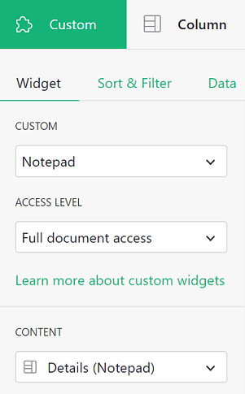*</span>
{: .screenshot-half }

If the text column you chose under Content has existing text, that text will appear in the Notepad widget, ready to be formatted.

<span class="screenshot-large">*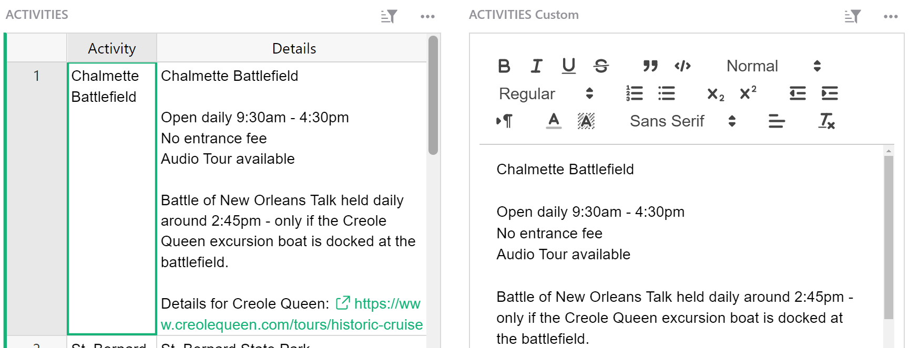*</span>

Use any of the options shown here to format your text.

<span class="screenshot-large">**</span>

As you can see in the screenshot below, the code for the formatted text is not useful to see in your table. You will edit text directly in the Notepad widget so you can [hide](widget-table.md#column-operations) this column from your data table.

<span class="screenshot-large">*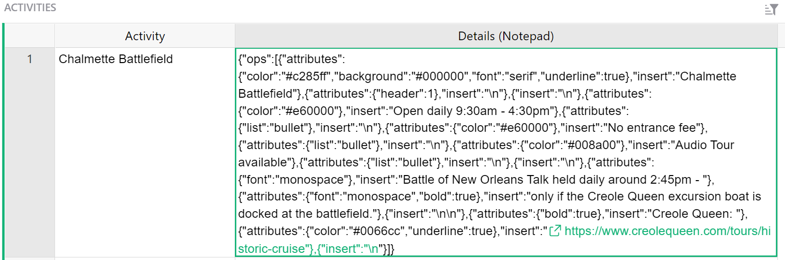*</span>

### Print Labels

The Print Labels custom widget allows you to customize and print labels directly from Grist.

<span class="screenshot-large">*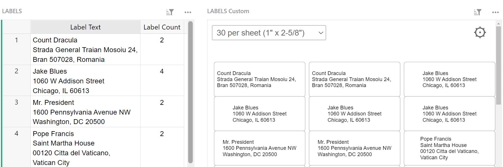*</span>

To start, add a new column to your table. This column will contain the text for the label. Optionally, you can add a second column to specify a label count, allowing you to print more than one of the same label without having to create duplicate records.

Next, add a new custom widget to the page. Choose the data table that contains the label details.

<span class="screenshot-large">**</span>
{: .screenshot-half }

To configure, select 'Print Labels' from the Custom dropdown and allow access to read the selected table. Under 'Label', select the column that contains the text to include on the labels. If you wish to print more than one of any labels, select the column that contains the number of labels for each record you wish to print.

<span class="screenshot-large">**</span>
{: .screenshot-half }

You can select from standard sheet sizes under the dropdown in the upper left of the widget. Be sure to save any changes by clicking the green check mark at the upper right of the widget.

<span class="screenshot-large">*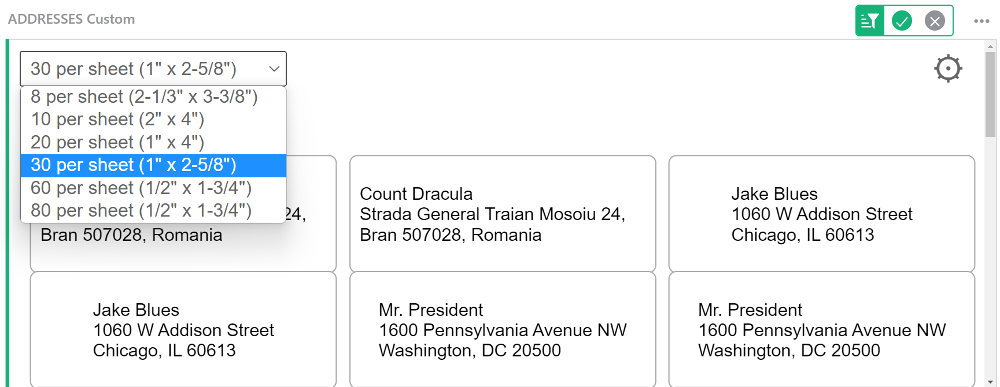*</span>
{: .screenshot-half }

To leave any blank labels at the beginning of the sheet, click the settings icon then specify how many labels should be left blank. This is especially helpful if a portion of your label sheet has already been used. You can skip the used labels and begin printing on your first unused label.

<span class="screenshot-large">*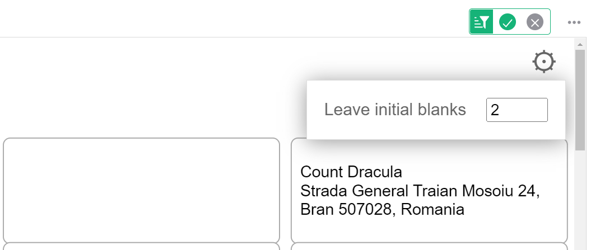*</span>
{: .screenshot-half }