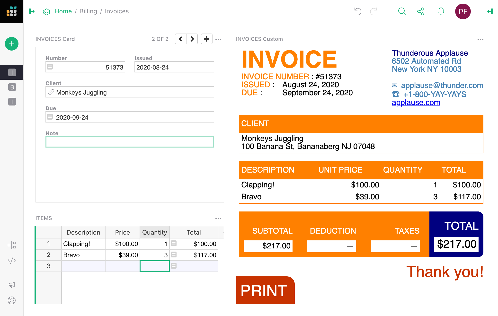

# Page widget: Custom

!!! warning "Custom widgets are an experimental feature"
    The design of custom widgets is likely to evolve, and sometimes
    that will require updates to documents that use them.  We won't
    make such changes lightly.

The **Custom** widget allows a user to insert almost
anything in their document.  To create a custom widget currently
requires knowledge of web development, and access to a public web
server (for example, GitHub Pages).

A good use for custom widgets is to view records or tables in new ways.
Using Grist as your data model and modern HTML/CSS/JS as your view is
very powerful.

## Minimal example

To demonstrate to a web developer how custom widgets work,
there is a minimal working example at:

> <https://public.getgrist.com/911KcgKA95oQ/Minimal-Custom-Widget/m/fork>

The example shows a table with some random data (names for pets), and
two custom widgets, one showing the selected row in the table as JSON,
and the other showing all rows of the table as JSON.  If you change
data in the table, or move the cursor, the custom widgets update as
appropriate.


The source code for the widgets is at:

> <https://github.com/gristlabs/grist-widget/tree/master/inspect>

It is stripped down to the essentials.  Here is the full source code of the
`onRecord` widget that shows one row of data:


```html
<!DOCTYPE html>
<html lang="en">
  <head>
    <meta charset="utf-8">
    <title>onRecord</title>
    <script src="https://docs.getgrist.com/grist-plugin-api.js"></script>
  </head>
  <body>
    <pre id="readout">Waiting for data...</pre>
    <script>
      grist.ready();
      grist.onRecord(function(record) {
        document.getElementById('readout').innerHTML = JSON.stringify(record, null, 2);
      });
    </script>
  </body>
</html>
```

The "Grist" parts of this are:

 * Including `https://docs.getgrist.com/grist-plugin-api.js` to get the Grist API.
 * Calling `grist.ready` to let Grist know the widget is ready to go.
 * Calling `grist.onRecord` to subscribe to the current row of the table.

After that, everything else is regular HTML/CSS/JS.
Once you have data coming in, you can render it any way you like, using React,
Vue.js, or your favorite framework.  For example, you could render
records as a [printable invoice](examples/2020-08-invoices.md), or use some
obscure chart format that Grist doesn't currently support.

## Adding a custom widget

To add a custom widget that reads from a table, click on `Add New`, 
then `Add Widget to Page`. Then:

  * For `Select Widget` choose `Custom` to get a Custom Widget.
  * For `Select Data` choose the table you want the widget to read data from.
  * Optionally, choose `Select By` to control the selected data further (read [Linking Page Widgets](linking-widgets.md) for the possibilities).


The custom widget is initially blank.  To configure it, click the three-dots button
on the top right of the custom widget, and select "Widget options".


In the `CUSTOM` settings section where it says `Enter Custom URL`, put
the link to your custom widget.  Here is a test widget to simply show table data
in JSON:

> <https://gristlabs.github.io/grist-widget/inspect/onRecords.html>

And here's one to show the selected row only (make sure "Select By" is set
for the custom widget):

> <https://gristlabs.github.io/grist-widget/inspect/onRecord.html>

## Access level

When you put a link to a custom webpage it will be immediately rendered inside the section. 
Now you have the option to grant that webpage access to data in your document.  The 
following access levels are available:

   - *No document access*: the webpage is shown in the widget, but it has no access to
     the Grist document containing the widget.
   - *Read selected table*: the webpage is shown in the widget, and is given read access
     to the table the widget is configured to select data from.
   - *Full document access*: the webpage is shown in the widget, and has full access to
     read and modify the Grist document containing the widget.

The webpage should be owned and controlled by you or someone you
trust.  With `Read selected table` permissions, a widget could send the
data it accesses to a third party.  With `Full document access` permissions, a widget could
send all the document data to a third party, and modify your document in
any way.

We do not recommend using `Full document access` permissions at this time, since the API
for modifying the document is not yet stabilized.  If you have
an urgent need, however, do contact us and request early access.

If you are writing your own custom widget you can specify what access level it needs as
part of initial __ready__ message, available levels are `none`, `read table` and `full`.

```html
<script>
  grist.ready({
    requiredAccess: 'read table'
  });
  grist.onRecord(function(record) {
    document.getElementById('readout').innerHTML = JSON.stringify(record, null, 2);
  });
</script>
```

It will tell Grist to ask the user if he wishes to grant your widget the required
permission. Your widget will be reloaded with the appropriate access level if the user
approves the request.

<center></center>

To check what access level is currently granted, you have two options. The first is to
check the URL - the access level will be appended to the widget URL as a query parameter.

> <https://gristlabs.github.io/grist-widget/inspect/onRecord.html?access=read>

The second option, is to subscribe to a second event exposed by the Grist API:

```javascript
grist.onOptions(function(options, settings) {
  console.log(settings.access_level);
});
```

For now, just skip the first parameter (it will be described in
[Widget options](widget-custom.md#widget-options) ). The current access level is part of
the second parameter, which describes how Grist will interact with your widget.

## Invoice example

The minimal example above showed records as plain JSON, but the widget
can get as fancy as you like.  Here is an example of showing a record
as a printable invoice:



You can read the details of how to use
this widget in our [Invoice preparation example](examples/2020-08-invoices.md).
The invoice widget is hosted at:

> <https://gristlabs.github.io/grist-widget/invoices/>

And the source HTML/CSS/JS can be browsed at:

> <https://github.com/gristlabs/grist-widget/tree/master/invoices>

It uses Vue.js and `grist.onRecord`.

## Creating a custom widget

As you saw, writing a simple widget that uses data from a table is very easy. First, you
need to tell Grist that you are ready and then subscribe to one of the available events:
`onRecord`, `onRecords` or `onOptions`.

```javascript
grist.ready();
grist.onRecord(function (record) {
  // Your logic
});
```

Let's say you want build a custom widget that will show the image from the URL and
optionally a single line of text below that image as the image title. You will need to
read two values from two columns: `Link` and `Title`.

You can, of course, access those columns directly using literal column names in your
script. Here is a complete source code of the widget that will do the job.

```html
<script src="https://docs.getgrist.com/grist-plugin-api.js"></script>

<div id="title" />
<script>
  grist.ready();
  grist.onRecord(function (record) {
    document.getElementById('image').src = record.Link;
    document.getElementById('title').innerText = record.Title;
  });
</script>
```

This is a good approach when experimenting with Grist API, but it has two significant
drawbacks. Every time you rename a column, you will also have to change your widget's
source code. Also, you won't be able to use this widget on a different table or share it
with your friends as column names might be different.

### Columns mapping

Instead of using those columns directly, you can ask the user to pick which column to use
as a `Link` and `Title`. The list of expected columns can be sent to Grist as part of the
ready method call:

```js
grist.ready({columns: ['Link', 'Title']});
```

Using this information, in the creator panel, Grist will hide the regular "Visible" column
section and display a new UI for user to choose correct column.

<center></center>

Your widget will receive this mapping configuration as part of `onRecord` or `onRecords`
event in the second parameter. You can use this configuration to do the mappings yourself
or use an API method "mapColumnNames" to do it for you.

```javascript
grist.ready({columns: ['Link', 'Title']});
grist.onRecord(function (record, mappings) {
  const mapped = grist.mapColumnNames(record);
  if (mapped) {
    document.getElementById('image').src = mapped.Link;
    document.getElementById('title').innerText = mapped.Title;
    console.log(`Using ${mappings.Link} and ${mappings.Title} columns`);
  }
});
```

Now, if you rename one of the columns, the widget will still work. You can also use this
widget in any other table or share with a friend, as it doesn't depend on your table
structure and can be easily configured.

In the configuration used above, we told Grist that all the columns are required, and the
user can pick any column even if the column doesn't contain a text value. To be more
precise, we can include more options in the request. For example:

```javascript
grist.ready({columns: [
  {
    name: "Link", // What field we will read
    title: "Image link", // Friendly field name
    optional: false, // Is this optional field
    type: "Text" // What type of column we expect
  }
]});
```

The `optional` setting is important for `mapColumnNames` helper. This helper will return a
mapped record only when all required (not optional) columns are picked.

By default Grist will allow user to pick any type of column. To allow only column of
certain type you need to set a `type` property. Here are all the valid types:

`Any`, `Int` (*Integer column*), `Numeric` (*Numeric column*), `Text`, `Date`, `DateTime`,
`Bool` (*Toggle column*), `Choice`, `ChoiceList`, `Ref` (*Reference column*), `RefList`
(*Reference List*), `Attachments`.

Suppose the user deletes a column or changes its type so that it will no longer match the
type requested by the widget. In that case, Grist will automatically remove this column
from the mappings.

## Widget options

If your widget needs to store some local options, Grist offers a simple key-value storage
API that you can use. Here are some JavaScript snippets that you can use for this purpose:

```js
// Store a simple text value 
await grist.widgetApi.setOption('color', '#FF0000');

// Store complex objects as json
await grist.widgetApi.setOption('settings', { lines: 10, skipFirst: true});

// Read previously saved option
const color = await grist.widgetApi.getOption('color');

// Clear all local options
await grist.widgetApi.clearOptions();
```

When your widget saves or edits some option, the icon on top of the section gets
highlighted in green. You (or someone using your widget) can either apply those options to
the widget or revert the modification. This allows viewers (users with read-only access)
to configure your widget without modifying the original configuration.

<span class="screenshot-large">**</span>
{: .screenshot-half }

Saving current options you will apply them to the widget and make them available to other
collaborators. Using this menu, you can also reset all settings that the widget has saved.
To do this, press the little trash icon and then `Save`.

Grist will also trigger an event, every time the options are changed (or cleared). Here is
how you can subscribe to this event.

```javascript
grist.onOptions(function(options, settings) {
  if (options) {
    console.log('Current color', options.color);
  } else {
    // No widget options were saved.
  }
});
```

If you are building your own widget, you generally should not read options directly (using
`grist.widgetApi.getOption()`). A better pattern is to apply them all when they are
changed. Using the `onOptions` handler will make your widget easier to change and
understand later.

Suppose your widget has some kind of configuration panel. In that case, you probably need
some button or other UI element that the user can use to show it. This additional UI
element will likely be rarely used by you or your collaborators, so it doesn't make sense
to show it all the time. To help with this, Grist offers an additional interaction option
you can send as part of the ready message.

```javascript
grist.ready({
  onEditOptions: function() {
    // Your logic to open the configuration panel.
  }
});
```

This will tell Grist to display an additional button `Open configuration` in the creator
panel and the section menu. When clicked, it will trigger your handler, which you can use
to show your own custom configuration screen.

<span class="screenshot-large">**</span>
{: .screenshot-half }
