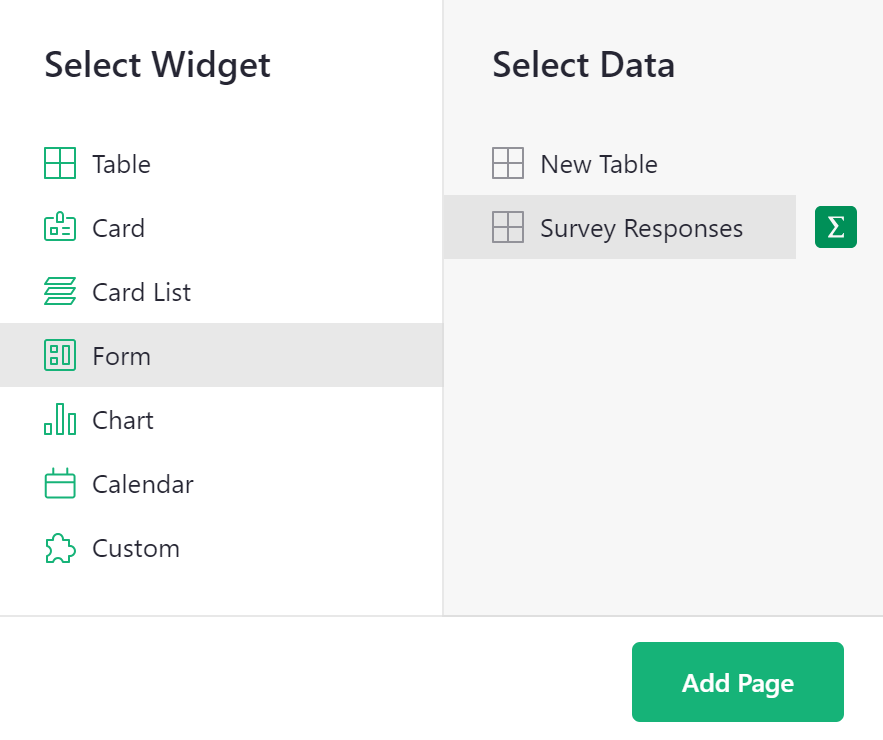
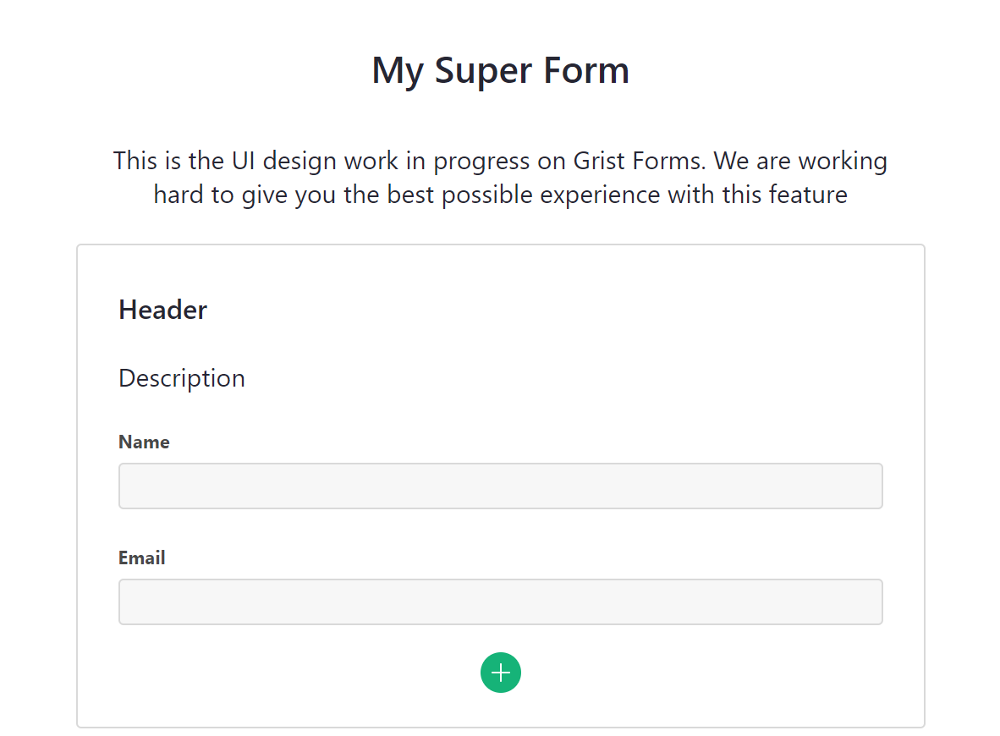
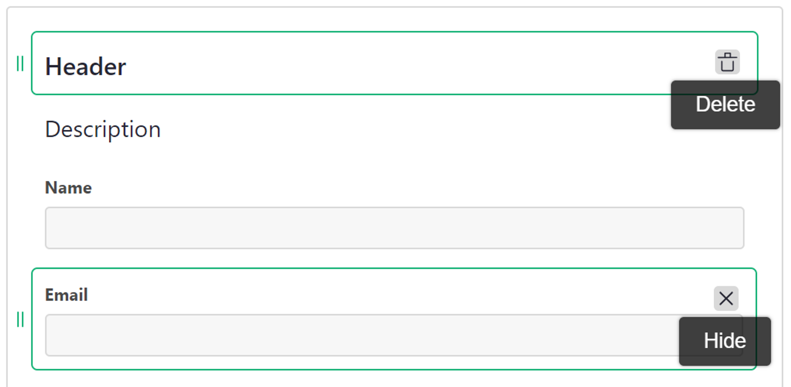

# Page widget: Form

The form widget allows you to collect data in a form view which populates your Grist data table upon submission.

**
{: .screenshot-half }

## Setting up your data

Create a table containing the columns of data you wish to populate via form.

**

## Creating your form

Add a form widget from the 'Add New' menu. Select the data table you wish to populate with form data. 

**
{: .screenshot-half }

Then, customize the form to your heart's desire!

By default, the form view will include elements for headers and descriptions as well as all columns (fields) from the underlying data table. 

**

To add additional form elements, click the + icon at the bottom of the form. From the menu, you can add the following elements;

1. **New Question:** Select a column type to create a new field. `••• More >` will open an expanded menu listing all column types. Adding a new question will add a new column to the underlying data table.
2. **Unmapped Fields:** Lists any hidden fields from the underlying data table.
3. **Building Blocks:** Customize further by adding these additional elements!

You can remove any element from the form by hovering over the object and clicking the trash icon to delete. You can hide any uneccessary fields from the form by hovering over the object and clicking the x icon.

**

Header and Paragraph elements allow the use of Markdown formatting. For help on Markdown formatting, check out the [Markdown Guide](https://www.markdownguide.org/basic-syntax/).

**

!!! note "HTML Formatting"
    HTML tags can be used in Markdown-formatted text. Be sure to separate block-level HTML elements like `
` and `
` from other elements using blank lines.

## Publishing your form

Once you have finished customizing your form, you have the option to preview your form, prior to publishing.

**

Previewing will allow you to see what your form will look like to end users, without making it available for use.

After you have confirmed everything is as you wish, you can publish your form. Note that only users with OWNER access have permission to publish a form.

The first time you publish a form, the following informational popup will appear, explaining the permissions a published form grants.

**

Once a form has been published, a button will appear to copy the link to the form. Share this link with end users to fill out your form! You also have the option to unpublish your form. Note that unpublishing the form will disable the share link. Users accessing the form via that link would then see an error.

**

## Form Submissions

After sharing the link to your published form, end users can submit data to your Grist document via the form.

**

All submitted data will appear in your underlying data table in your Grist document! Collecting data has never been so easy. 😍

**

