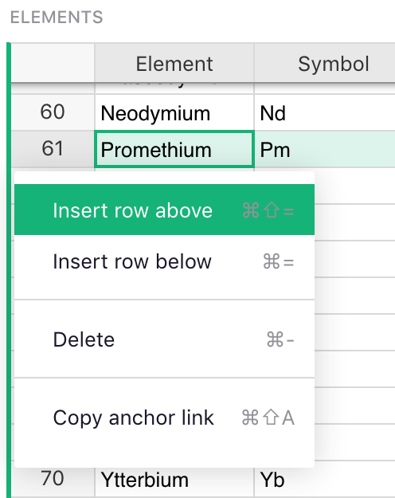

# Page widget: Table

The **Table** widget is a versatile spreadsheet-like grid.

  

Here are some useful features to know.

### Column operations

- **Resize columns**: Click on the line between column headers, and drag it to resize columns.

- **Reorder columns**: With a column selected, drag its header to move it to a different place
  relative to other columns. (You can also do this by reordering fields in the widget
  options panel.)

- **Rename columns**: With a column selected, click its header to rename it. Hit <code class="keys">*Enter*</code> to
  save the new name.

- **Add columns**: Click the "+" icon on the right of all the column headers to add a new column,
  or show any of the hidden columns. The column menu also allows inserting a new column next to an
  existing column, as do the keyboard shortcuts <code class="keys">*Alt* + **+**</code>
  (insert before) and <code class="keys">*Alt* + **=**</code> (insert after).

    **
    {: .screenshot-half }

    After adding a column, the column name (set by default to "A", "B", "C", etc.) is immediately
    selected and highlighted to let you quickly rename it. Just type in the new name and hit <code
    class="keys">*Enter*</code>, or hit <code class="keys">*Escape*</code> to keep the default name.

- **Hide columns**: Move the mouse over the column header and click the triangle to open the
  column menu. Click "Hide column" to hide the column. The column remains in the underlying data, and can be
  shown again using the "+" icon on the right of the column headers, or the field list in the widget
  options panel.

  **
  {: .screenshot-half }

- **Delete columns**: Delete the actual column of data using the column menu option, or the
  <code class="keys">*Alt* + *Minus*</code> keyboard shortcut. The table is the only widget that
  allows deleting a column.

    **Note:** *deleting* and *hiding* are different. Hiding a columns removes it
    only from the current page widget, but leaves it in the data and available to formulas.
    Deleting a column removes it from everywhere. (Of course, undo still works for either
    operation!)

### Row operations

- **Add rows**: Type into the last row in a table, which is highlighted to indicate that it's a
  placeholder for adding new records. Right click a row number to insert a blank row next to an
  existing row, or use the keyboard shortcuts
  <code class="keys">*⌘* *⇧* *=*</code> (Mac) or <code class="keys">*Ctrl* + *Shift* + **=**</code> (Windows)
  to insert before, and
  <code class="keys">*⌘* **=**</code> (Mac) or <code class="keys">*Ctrl* + **=**</code> (Windows)
  to insert after.

  **
  {: .screenshot-half }

- **Delete rows**: Right click a row number and select the "Delete" option to delete a row, or use the
  <code class="keys">*⌘* + *Minus*</code> (Mac) or <code class="keys">*Ctrl* + *Minus*</code> (Windows)
  shortcut. If you select a range of cells first, either of these delete actions will delete all
  rows included in the range.

- **Link to rows**: Right click a row number and select "Copy anchor link" to copy a link to the
  selected cell of that row. The link will be placed in your clipboard, ready to paste into an
  email or an instant messaging app. The link will open only for people with access to the
  document.

  **
  {: .screenshot-half }

### Navigation and selection

- **Navigate using shortcuts**: Use keyboard shortcuts to navigate the grid:

    <code class="keys">*Tab*</code>, <code class="keys">*Shift* + *Tab*</code>
    Move to the next or previous column, saving changes if editing a cell.

    <code class="keys">*⌘* + *Up*</code> (Mac) or <code class="keys">*Ctrl* + *Up*</code> (Windows)  Move up to the first row.

    <code class="keys">*⌘* + *Down*</code> (Mac) or <code class="keys">*Ctrl* + *Down*</code> (Windows)  Move down to the last row.

    <code class="keys">*Home*</code> or <code class="keys">*Fn* + **←**</code> (Mac)  Move to the beginning of a row.

    <code class="keys">*End*</code> or <code class="keys">*Fn* + **→**</code> (Mac)  Move to the end of a row.

    <code class="keys">*PageDown*</code> or <code class="keys">*Fn* + **↓**</code> (Mac)  Move down one page of rows.

    <code class="keys">*PageUp*</code> or <code class="keys">*Fn* + **↑**</code> (Mac)  Move up one page of rows.

    <code class="keys">*Alt* + *Down*</code>, <code class="keys">*Alt* + *Up*</code>  Move down or up five rows.

- **Select ranges**: Click and drag a mouse across the grid to select a range of cells to copy
  (copy and paste using the usual
  keyboard shortcuts for your computer). Another way to select a range is to
  click one cell, and then hold <code class="keys">*Shift*</code> while clicking another cell, or
  while navigating with the arrow keys.

- **Fill down data**: Select a range of cells, and hit
  <code class="keys">*⌘* + *D*</code> (Mac) or <code class="keys">*Ctrl* + *D*</code> (Windows)
  to fill the whole selected range with the values of the cells in the top row of the range.

### Customization

- **Customize table looks**: In the widget options panel, you can turn off horizontal or vertical
  grid lines, or turn on zebra striping.

  **
  {: .screenshot-half }

  For example, this lets you change the look of your grid to a list like this:
  
