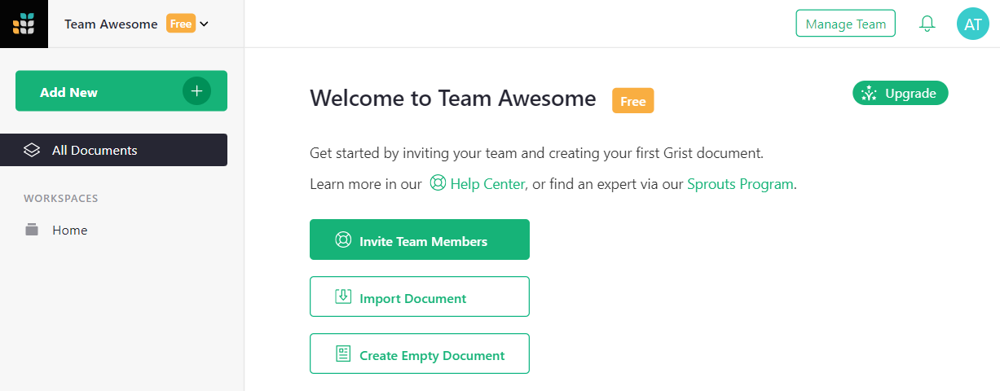
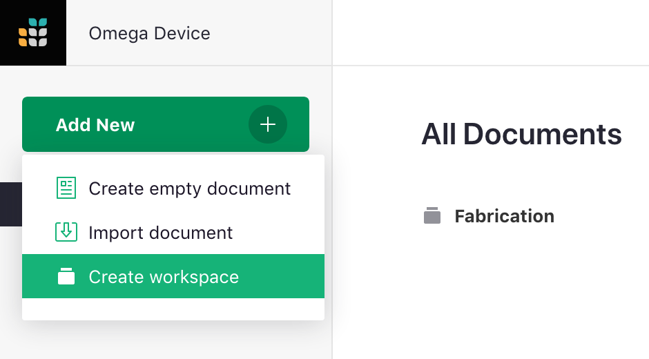

Workspaces
-------------------------------

Documents can be collected in folders
called "workspaces" which can be shared as a single unit with other users.
This is convenient, for example, for documents related to a single project.

When a site is first created, it has a single workspace called "Home."

You can rename that workspace if you like, by hovering over
the workspace name on the left bar, clicking on the three-dots icon,
and selecting "Rename".

**
{: .screenshot-half }

Even better, you can create new workspaces, so you can group
your documents and share them as a unit.

**
{: .screenshot-half }

To add a document to a specific workspace, click on that workspace in
the left bar, then select "Add New", then "Create empty document"
(or "Import document").

**
{: .screenshot-half }

To move a document from one workspace to another, hover over the document,
click on the three-dots icon to the right of the document's name, and
select "Move".

You'll then have the option to pick the workspace you want.

On [team sites](teams.md), workspace owners can control who has access to a workspace using "Manage Users."
The controls are just like for [sharing documents](sharing.md). Workspaces in [personal sites](teams.md#understanding-personal-sites) cannot be shared.

Viewers of a team site will also be viewers of all its workspaces.
Likewise for editors and owners.  To exclude a workspace from
inheriting team site viewers, editors, and owners, set "Inherit Access"
to "None".  You can also set it to "View Only" to limit inheritance to
view rights, or "View & Edit" to limit inheritance to view and edit rights
(excluding the right to control sharing options).

It is possible to be an editor/owner of a workspace and not be able to
open all documents within that workspace.  This can happen if an owner
of a document limits inheritance to "None."  You will still see the
document listed, so that if you ever decide to delete the workspace
you'll know what you're deleting.  Viewers of a workspace will only
see documents they have access to listed.